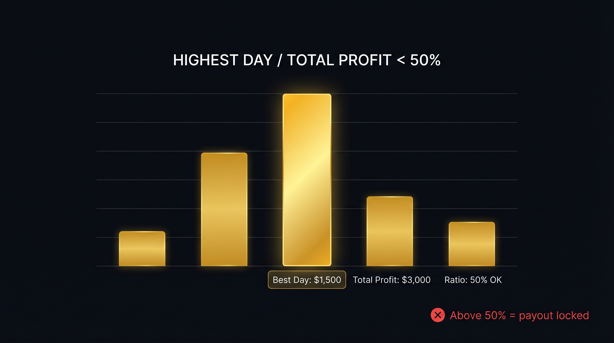

# Reseña Apex Trader Funding 2026: Reglas, Precios, Payouts y Descuento MARKET

*Última actualización: 17 de abril de 2026 — 14 min de lectura*


> **TL;DR** — Apex Trader Funding es la Prop Firm solo de futuros más grande de EE.UU., calificada con 4,4/5 en Trustpilot con más de 19.000 reseñas. El plan de entrada cuesta **US$19,90 con el cupón Lifetime MARKET** (90% OFF), el profit split es del **100%** y los payouts se liberan cada **5 días de trading**. Las dos cosas que tumban a la mayoría de los traders: la **regla de consistencia del 50%** y el **trailing drawdown intraday**. Ambas se explican en detalle abajo.

| Datos Rápidos | |
|---|---|
| **Tipo de firma** | Prop Firm de futuros (EE.UU.) |
| **Fundada** | 2019 |
| **Evaluación** | 1-step, sin mínimo de tiempo para aprobar (mínimo 1 día de trading) |
| **Tamaños de cuenta** | 25K, 50K, 100K, 150K |
| **Precio de entrada (25K)** | US$199 → **US$19,90 con MARKET** |
| **Cuota de activación** | US$85 única (tras aprobar la evaluación) |
| **Profit split** | 100% (sin split en las cuentas fondeadas simuladas) |
| **Opciones de drawdown** | Intraday Trailing O End-of-Day (EOD) |
| **Regla de consistencia** | 50% máx de la ganancia total en un solo día |
| **Ciclo de payout** | Cada 5 días de trading |
| **Máx cuentas por trader** | 20 |
| **Plataformas** | Rithmic, Tradovate, Wealthcharts |
| **Trustpilot** | 4,4/5 (19.000+ reseñas) |
| **Código de afiliado** | [MARKET](https://apextraderfunding.com/member/aff/go/evertonmiranda) (90% Lifetime) |

---

## ¿Qué es Apex Trader Funding?

Apex Trader Funding es una Prop Firm de evaluación con sede en Texas. Permite a los traders probar su habilidad en una cuenta de futuros simulada, y una vez que aprueban la evaluación, operan una "Performance Account" (PA) simulada donde su performance es replicada por la mesa de capital live de Apex. Cada dólar ganado en la PA se paga al trader, menos una cuota única de activación.

Apex es una de las firmas de futuros más antiguas y activas del mercado. Desde enero de 2023 ha pagado un promedio de más de US$1 millón por mes a los clientes, haciéndola una de las operaciones de payout de mayor volumen de la industria.

Opera bajo un modelo puro **solo de futuros** — sin forex, sin CFDs, sin cripto spot. Operas contratos listados en CME, CBOT, NYMEX, COMEX y EUREX.

El **1 de marzo de 2026**, Apex lanzó un programa rediseñado (referido como el "All New Apex") con reglas simplificadas, matemática de drawdown más clara y la regla de consistencia del 50% reemplazando a la antigua regla del 30%. Las cuentas compradas antes del 1 de marzo de 2026 son **cuentas legacy** y continúan con el set de reglas original. Esta reseña se enfoca en el **nuevo** programa.

### Por qué la mayoría considera Apex

La razón por la que Apex domina este mercado es una combinación de tres cosas:
1. **Precios agresivos** con el cupón Lifetime MARKET
2. **100% de profit split** en las cuentas fondeadas simuladas (sin split con la firma)
3. **Un camino claro** de la evaluación al payout — sin revisiones discrecionales ocultas

---

## Precios de Apex Trader Funding (2026)

Apex vende cuatro tamaños de cuenta. Cada uno tiene una cuota única de evaluación y una **cuota de activación de US$85 separada** que se paga tras aprobar.

Con el cupón **MARKET**, las cuotas de evaluación tienen aproximadamente 90% OFF de descuento, y el descuento aplica **por la vida de tu relación con Apex** (cada compra, cada reset, cada nueva cuenta).

### Tamaños de cuenta y precios de Apex

| Cuenta | Precio Regular | Con MARKET | Meta de ganancia | Max drawdown | Daily loss limit (solo EOD) |
|---|---|---|---|---|---|
| **25K** | US$199 | **US$19,90** | US$1.500 | US$1.000 | US$500 |
| **50K** | US$249 | **US$24,90** | US$3.000 | US$2.000 | US$1.000 |
| **100K** | US$399 | **US$39,90** | US$6.000 | US$3.000 | US$1.500 |
| **150K** | US$599 | **US$59,90** | US$8.000 | US$4.000 | US$2.000 |

> **Nota:** La cuenta 100K a menudo ofrece la mejor relación contrato-a-drawdown para swing traders. La 25K tiene el costo de entrada más bajo pero el drawdown más apretado para position sizing.

### Cuota de activación

Tras aprobar la evaluación, pagas una **cuota única de activación de US$85** para pasar a tu Performance Account. Esto no es recurrente — pagas una vez, y la PA permanece activa mientras no sea rota.

Tienes **7 días** desde aprobar la evaluación para activar tu PA. Si no lo haces en esa ventana, pierdes la aprobación.

### ¿Hay cuota de reset?

El nuevo programa de Apex **no ofrece resets** en las evaluaciones. Si rompes tu cuenta de evaluación, compras una nueva evaluación. El reloj de 30 días de la evaluación tampoco se resetea — si no apruebas en 30 días, la evaluación expira.

Las cuentas legacy (pre-1 de marzo de 2026) retienen la opción de **reset por US$80**.

### Cómo reclamar el cupón MARKET

1. Ve a la página de precios de Apex a través de [este link](https://apextraderfunding.com/member/aff/go/evertonmiranda)
2. Elige tu tamaño de cuenta y tipo de drawdown
3. En el checkout, ingresa el código de cupón **MARKET**
4. Confirma que el descuento aparece antes de completar el pago

El cupón queda vinculado a tu afiliado, lo que significa que permanece activo en tu cuenta para cada compra futura mientras sigas vinculado.

---

## Tipos de Cuenta: Intraday Trail vs End-of-Day Trail

Apex te deja elegir entre dos mecánicas de drawdown. Elige con cuidado — la equivocada para tu estilo te sacará de la cuenta más rápido de lo que piensas.


### Intraday Trailing Drawdown

El **Intraday Trail** ajusta tu umbral de drawdown en tiempo real basado en el balance más alto de la cuenta durante la sesión, incluyendo ganancias no realizadas.

**Cómo funciona:**
- El umbral empieza en: balance inicial − max drawdown (ej., US$50.000 − US$2.000 = US$48.000)
- A medida que tu cuenta alcanza nuevos máximos (realizados O no realizados), el umbral sube
- El umbral **nunca baja**
- Si el balance de la cuenta toca el umbral en cualquier momento, todas las posiciones se liquidan automáticamente

**Ejemplo — Evaluación 50K Intraday:**
1. Abres un trade y tu balance momentáneamente toca US$50.900 en ganancia no realizada
2. Nuevo umbral: US$50.900 − US$2.000 = US$48.900
3. Cierras el trade en US$50.300 (ganancia de US$300)
4. El umbral se queda en US$48.900 — no baja
5. Si tu balance alguna vez toca US$48.900, la cuenta se rompe

**¿Cuándo se detiene el trailing?**
- **Evaluación (Rithmic y Wealthcharts):** Se bloquea cuando el balance alcanza la meta de ganancia + max drawdown (para la 50K, eso es US$55.000 → umbral fijo en US$53.000)
- **Evaluación (Tradovate):** Nunca se bloquea — trailing indefinido
- **Performance Account:** Se bloquea cuando el umbral alcanza balance inicial + US$100 (para la PA 50K, eso es US$50.100)

El Intraday Trail es castigador porque **el PnL no realizado cuenta**. Si estás en un trade mostrando US$500 de ganancia abierta, tu drawdown acaba de ajustarse US$500 más apretado aunque el trade luego se vaya a negativo.

### End-of-Day (EOD) Trailing Drawdown

El **EOD Trail** solo se actualiza al cierre del mercado (4 PM CT). La ganancia no realizada durante el día **no** mueve el umbral — solo importa tu balance de cierre.

**Cómo funciona:**
- Mismo umbral inicial que el Intraday (balance − max drawdown)
- A las 4 PM CT, si tu balance de cierre es más alto que cualquier cierre anterior, el umbral sube
- Dentro de la sesión, el umbral es fijo — tienes espacio para respirar

Las cuentas EOD vienen con una regla extra: un **Daily Loss Limit (DLL)**.

**DLL por tamaño de cuenta (Evaluación):**
| Cuenta | Daily Loss Limit |
|---|---|
| 25K | US$500 |
| 50K | US$1.000 |
| 100K | US$1.500 |
| 150K | US$2.000 |

Si tu pérdida intraday toca el DLL, todas las posiciones se auto-liquidan y el trading pausa hasta la próxima sesión (se resetea a las 6 PM ET). No fallas la cuenta — solo quedas bloqueado por el día.

### ¿Qué tipo de drawdown deberías elegir?

| Tu estilo | Elige |
|---|---|
| Scalping, entrar y salir rápido | **Intraday** (raramente cargas ganancia no realizada) |
| Swing, manteniendo ganadores | **EOD** (las ganancias no realizadas no te muerden) |
| Mean reversion / fade | **EOD** (toleras más heat) |
| Sobreoperación cuando persigues | **EOD** (el DLL te detiene de hacer revenge trading a cero) |
| Quieres máxima flexibilidad | **Intraday** (sin DLL, sin cap de sesión) |

La mayoría de los traders Apex experimentados recomiendan **EOD** para cualquier cosa más allá del scalping puro. El Intraday Trail está diseñado para premiar la ejecución rápida y decidida — y castigar la duda.

---

## Plataformas de Trading Soportadas

Apex se integra con tres plataformas. Cada una tiene un set de features diferente, y tu comportamiento de drawdown puede variar dependiendo de en cuál estés.

### Rithmic

La elección más popular entre los traders de Apex. Rithmic es un motor de datos de mercado y enrutamiento, y funciona con plataformas front-end como **NinjaTrader**, **Quantower**, **Volumetrica**, **ATAS** y **MotiveWave**.

**Por qué los traders eligen Rithmic:**
- Feed de datos de latencia más baja
- Funciona con virtualmente cada front-end de futuros
- Conexión a NinjaTrader incluida sin costo extra (valor US$75)
- Cuotas de data CME en tiempo real incluidas (valor US$55)

### Tradovate

Basada en browser y con enfoque mobile-first. Tradovate maneja tanto la plataforma como el enrutamiento — no se necesita front-end separado.

**Por qué los traders eligen Tradovate:**
- Sin instalación de software (corre en browser)
- App móvil incluida
- Acceso a EUREX (DAX, Euro Stoxx, Bunds) — Rithmic actualmente no enruta estos en Apex

**Advertencia:** En las evaluaciones de Tradovate, el trailing drawdown intraday **nunca deja de trailing**. Eso es más duro que Rithmic/Wealthcharts.

### Wealthcharts

Una plataforma todo-en-uno de charting y ejecución diseñada para Apex. UI más pulido que NinjaTrader, indicadores integrados e integración más estrecha con el dashboard de Apex.

**Por qué los traders eligen Wealthcharts:**
- UI limpia y moderna
- Biblioteca de indicadores integrada
- Sin necesidad de licencia separada de NinjaTrader

---

## Reglas de Evaluación de Apex (Cuentas Nuevas)

La evaluación es el challenge simulado que debes aprobar antes de correr una Performance Account. La evaluación de Apex es una de las más permisivas de la industria.

### Meta de ganancia

Necesitas alcanzar la meta de ganancia una vez, en cualquier momento durante la evaluación. No necesitas cerrar el día encima de ella — solo necesitas tocarla.

- **25K:** US$1.500
- **50K:** US$3.000
- **100K:** US$6.000
- **150K:** US$8.000

### Días mínimos de trading

**1 día.** Si alcanzas la meta de ganancia en una sola sesión, apruebas. Sin mínimo de 5 o 10 días como FTMO.

### Límite de tiempo

Tienes **30 días** desde la compra para aprobar. Tras 30 días, la evaluación expira sin opción de reset en cuentas nuevas.

### Límites de contratos durante la evaluación

| Cuenta | Max contratos mini | Max contratos micro |
|---|---|---|
| 25K | 4 | 40 |
| 50K | 10 | 100 |
| 100K | 14 | 140 |
| 150K | 17 | 170 |

### Qué puedes operar

Todos los instrumentos listados en la ficha de instrumentos de Apex: ES, NQ, YM, RTY, CL, GC, 6E, 6B y docenas más (lista completa en la sección "Qué Puedes Operar" abajo).

### Qué no puedes hacer durante la evaluación

- Mantener posiciones durante la ventana de reset diario de las 4:59 PM CT
- Mantener posiciones durante el cierre de fin de semana de las 5:00 PM CT (viernes)
- Exceder el tamaño máximo de contratos en cualquier momento
- Usar automatización de copy-trading entre cuentas Apex durante la evaluación (permitido solo en PA)

El news trading está **permitido** — Apex no restringe el trading alrededor de eventos económicos de alto impacto.

---

## Reglas de la Performance Account (PA)

Tras aprobar y pagar la cuota de activación de US$85, entras a una **Performance Account (PA)**. Aquí es donde ganas los payouts reales.

### Regla de Consistencia del 50%



Esta es la única regla que detiene a más traders de cobrar que cualquier otra.

**Lo que significa:** Tu mayor día rentable de trading no puede exceder el 50% de tu ganancia acumulada total al momento en que solicitas un payout.

**La matemática:**
```
Mayor día de ganancia ÷ Ganancia total = % de Consistencia
```
El resultado debe estar **debajo del 50%** para que tu botón de payout se active.

**Ejemplo:**
- Estás en una PA 50K
- Tu mejor día: US$1.500 de ganancia
- Tu ganancia total desde el inicio de la cuenta (o último payout): US$2.500

Cálculo: US$1.500 ÷ US$2.500 = **60%** → payout **no** disponible.

Para desbloquear el payout, necesitas subir tu ganancia total. La fórmula es:

```
Ganancia total mínima requerida = Mayor día de ganancia ÷ 0,5
```

Entonces: US$1.500 ÷ 0,5 = **US$3.000 de ganancia total mínima** antes de que puedas solicitar ese payout.

**Reset tras payout:** Una vez que tu payout es aprobado, el cálculo de consistencia se resetea. Los payouts futuros solo cuentan ganancias hechas después del último payout aprobado.

**Los días perdedores no cuentan.** Solo los días rentables están en el numerador/denominador.

### Tiers de Scaling y Daily Loss Limit (PAs EOD)


En las Performance Accounts EOD, tanto tu **tamaño máximo de contratos** como tu **Daily Loss Limit** escalan a medida que tu cuenta crece. Este es el "scaling integrado" de Apex — no necesitas solicitar un upgrade.

**Tabla de tiers de PA EOD 50K:**
| Rango de ganancia | Max contratos | Daily Loss Limit | Tier |
|---|---|---|---|
| US$0 – US$1.499 | 2 | US$1.000 | Level 1 |
| US$1.500 – US$2.999 | 3 | US$1.000 | Level 2 |
| US$3.000 – US$5.999 | 4 | US$2.000 | Level 3 |
| US$6.000+ | 4 | US$3.000 | Level 4 |

El tier máximo para cada tamaño de cuenta topa el DLL. La 50K topa en US$3.000; la 100K topa en US$3.500; la 150K topa en US$4.000.

### Profit split

**100%** en todas las Performance Accounts fondeadas simuladas. Apex no toma una parte de las ganancias de PA. Tu payout es tu balance ganado completo, sujeto a:
- La ganancia debe exceder el **umbral mínimo de payout** (US$500 para los primeros payouts)
- La regla de consistencia debe pasar
- Al menos 5 días de trading desde tu último payout (o primer trade)

### Cuentas máximas

Puedes correr hasta **20 cuentas Apex simultáneamente**, en cualquier combinación de tamaños y tipos de drawdown. Cada una tiene activación pagada por separado, y cada una tiene su propio P&L y reglas. Muchos veteranos de Apex corren 3-5 cuentas para diversificar el riesgo entre estrategias o para recolectar múltiples payouts en paralelo.

### Copy trading en PAs

Apex **permite el copy trading** entre tus propias PAs (no entre cuentas de diferentes traders). Puedes correr la misma estrategia en 10 cuentas simultáneamente vía AutoTrader, Copy-AT o herramientas similares.

---

## Sistema de Payout de Apex

### Frecuencia de payout

Puedes solicitar un payout cada **5 días de trading** (días hábiles en los que CME está abierta). Tu primer payout estará disponible 5 días de trading después de que tu PA se active.

### Monto mínimo de payout

US$500 por solicitud de payout.

### Caps de payout en payouts tempranos

Los primeros 5 payouts en una PA nueva están **capados en US$1.500 cada uno** (para la mayoría de los tamaños de cuenta). Tras tu 5º payout aprobado, el cap se levanta y puedes solicitar tu balance disponible completo hasta el safety net del balance inicial.

### Safety net

Hay un "safety net" integrado en la PA. Tu PA debe mantener un balance mínimo sobre el balance inicial antes de que cualquier payout pueda ser solicitado. El safety net escala con el tamaño de la cuenta — aproximadamente balance inicial + US$2.600 para la 50K. Consulta el FAQ de Apex para la cifra exacta al momento del payout.

### Métodos de payout

| Método | Velocidad | Cuotas |
|---|---|---|
| **Plane (ACH)** | 1–3 días hábiles | Bajas |
| **Wise** | 1–2 días hábiles | Varían por país |
| **Transferencia bancaria** | 3–5 días hábiles | Aplican cuotas bancarias |

Apex tiene un track record de pagar — la base de reseñas de Trustpilot de 19.000+ entradas está dominada por confirmaciones positivas de payout. Los retrasos sí ocurren (usualmente 2–7 días hábiles durante semanas de alto volumen), pero las denegaciones directas son raras en el nuevo programa. Apex anuncia explícitamente "**Sin Denegaciones de Payout**" en su branding, y el modelo operativo soporta esa afirmación en cuentas bien estructuradas.

### Máximo de solicitudes de payout por PA

Una PA nueva tiene un cap de **6 solicitudes de payout**. Tras el 6º, si la cuenta está saludable, Apex puede moverte a su **programa de trading live** — donde no hay cap de payout.

---

## Qué Puedes Operar en Apex

Todos los contratos son de CME Group o EUREX. Lista completa de instrumentos operados con frecuencia:

### Futuros de índice bursátil
- **E-mini S&P 500 (ES)** — US$50 por punto
- **Micro E-mini S&P 500 (MES)** — US$5 por punto
- **E-mini Nasdaq-100 (NQ)** — US$20 por punto
- **Micro E-mini Nasdaq-100 (MNQ)** — US$2 por punto
- **Mini-Dow (YM)** — US$5 por punto
- **Micro Dow (MYM)** — US$0,50 por punto
- **Russell 2000 (RTY)** — US$50 por punto
- **Micro Russell (M2K)** — US$5 por punto

### Energía
- **Crude Oil (CL)** — US$1.000 por punto
- **Micro Crude (MCL)** — US$100 por punto
- **Natural Gas (NG)** — US$10.000 por punto
- **E-mini Natural Gas (QG)** — US$2.500 por punto

### Metales *(disponibilidad varía — actualmente restringido en algunos contratos COMEX)*
- **Oro (GC)** — US$100 por punto
- **Micro Gold (MGC)** — US$10 por punto
- **Plata (SI)** — US$5.000 por punto

### Divisas
- **Euro FX (6E)**, **British Pound (6B)**, **Japanese Yen (6J)**, **Canadian Dollar (6C)**, **Australian Dollar (6A)**, **Swiss Franc (6S)**

### Agrícolas
- **Corn (ZC)**, **Soybeans (ZS)**, **Wheat (ZW)**, **Soybean Meal (ZM)**, **Soybean Oil (ZL)**

### Cripto (solo micros)
- **Micro Bitcoin (MBT)**, **Micro Ethereum (MET)**

### EUREX (solo Tradovate)
- **DAX (FDAX)**, **Mini-DAX (FDXM)**, **Euro Stoxx 50 (FESX)**, **Euro-Bund (FGBL)**

---

## Apex Trader Funding: Pros y Contras


### Pros

- **Descuento Lifetime** vía el cupón MARKET — aproximadamente 90% OFF cada compra, no una promo de primer pedido
- **100% de profit split** — sin parte tomada en las ganancias de PA
- **Más rápido al fondeo:** Aprueba en 1 día mínimo, activa el mismo día
- **Sin mínimo de tiempo para mantener trades** — los scalpers están bien
- **News trading permitido** — sin regla contra operar NFP, FOMC o CPI
- **Hasta 20 cuentas por trader** — escala horizontalmente
- **Elección de plataforma:** Rithmic, Tradovate o Wealthcharts
- **Track record de payouts:** Promedio de más de US$1M/mes a clientes desde 2023
- **Sin suscripción continua** — la cuota de evaluación y la cuota de activación son ambas únicas

### Contras

- **El Intraday Trailing Drawdown es implacable** — el PnL no realizado cuenta, y una vez que rompes estás fuera sin reembolso
- **La regla de consistencia del 50% bloquea payouts** — un solo día grande de ganancia puede retrasar los payouts por semanas
- **Sin opción de reset en cuentas nuevas** — una rotura te cuesta la cuota completa de evaluación
- **Ventana de evaluación de 30 días** — más corta que el "tiempo ilimitado" estándar de la industria
- **Los primeros 5 payouts capados en US$1.500** — llegar a payouts grandes toma tiempo
- **El safety net retrasa payouts tempranos** — el balance mínimo de PA debe mantenerse
- **Sistema dual legacy vs nuevo puede confundir** — las cuentas compradas antes del 1 de marzo de 2026 siguen reglas diferentes
- **Lista limitada de instrumentos durante restricciones COMEX** — la disponibilidad de metales fluctúa

---

## ¿Para Quién es Mejor Apex?

Apex es la firma correcta para ti si encajas en uno de estos perfiles:

**1. Scalper activo de futuros en ES, NQ o CL**
El mínimo de aprobación de 1 día, la política permisiva de noticias y la matemática apretada-pero-justa del drawdown recompensan a los traders rápidos y de alta frecuencia.

**2. Swing trader con estrategia multi-cuenta**
Corre 5 cuentas EOD 50K, usa el scaling integrado para hacer crecer cada una y recolecta payouts paralelos cada 5 días de trading.

**3. Trader sensible al precio empezando**
La entrada de US$19,90 con MARKET es el punto de entrada serio más barato en el prop trading de futuros. Puedes presupuestar tus primeros 3–4 intentos de evaluación por menos de US$80 en total.

**4. Trader que no quiere split**
La mayoría de las firmas toman 10–25% de las ganancias de PA. El 100% de split de Apex en cuentas fondeadas simuladas es el más alto que encontrarás.

**Quién debería mirar en otro lado:**
- Si prefieres forex o CFDs, Apex no los ofrece — considera FTMO o FundingPips
- Si quieres una evaluación de tiempo ilimitado, considera Take Profit Trader (sin límite de tiempo)
- Si el Intraday Trail se siente demasiado castigador, elige Apex EOD o prueba el modelo de drawdown estático de Bulenox

---

## Apex vs Otras Prop Firms

### Apex vs FTMO
FTMO es enfocada en forex, con evaluación 2-step, 80% de profit split y entrada de US$155 para la cuenta 10K. Apex es solo futuros, 1-step, 100% de split, entrada de US$19,90 (con MARKET). Si operas futuros, Apex gana en precio y split; FTMO gana si necesitas forex.

### Apex vs Bulenox
Bulenox ofrece mecánicas de evaluación de futuros similares pero con una opción de **drawdown estático** — sin umbral de trailing en absoluto. Si el Intraday Trail de Apex te ha quemado, vale la pena testear el drawdown estático de Bulenox. Bulenox tiende a tener metas de ganancia más altas.

### Apex vs Take Profit Trader
Take Profit Trader (TPT) ofrece tiempo de evaluación ilimitado y una estructura 1-step similar. TPT tiende a tener reglas de consistencia más estrictas (a menudo 40%) pero sin presión de tiempo. Buena alternativa si luchas con el reloj de 30 días de Apex.

### Apex vs Earn2Trade (E2T)
E2T tiene una evaluación "Gauntlet" (mínimo 15 días de trading) y un 80% de profit split. Más conservadora y metódica. Apex es más rápida y más barata por cuenta.

---

## Preguntas Frecuentes

### ¿Apex Trader Funding es confiable?

Sí. Apex ha estado operativa desde 2019, está calificada con 4,4/5 en Trustpilot con más de 19.000 reseñas y publica totales mensuales de payout a clientes (promediando más de US$1M por mes desde enero de 2023). Es una de las Prop Firms de futuros más establecidas de EE.UU.

### ¿Cuánto cuesta Apex Trader Funding?

La entrada comienza en **US$19,90** para la cuenta 25K al usar el cupón **MARKET** (90% OFF del precio regular de US$199). Tras aprobar la evaluación, pagas una **cuota única de activación de US$85** para pasar a una Performance Account. Sin facturación recurrente.

### ¿Cuál es la regla de consistencia de Apex?

La regla de consistencia del 50% significa que tu único mayor día rentable de trading no puede exceder el 50% de tu ganancia acumulada total al momento de una solicitud de payout. Si lo hace, la opción de payout se bloquea hasta que tu ganancia total crezca lo suficiente para bajar la ratio por debajo del 50%.

### ¿Cuánto toma aprobar la evaluación de Apex?

El mínimo es **1 día de trading**. El máximo es **30 días** desde la compra de la evaluación. La mayoría de los traders aprueban entre 5–15 días de trading.

### ¿Apex paga?

Sí. Apex libera payouts en un ciclo de 5 días de trading. El tiempo promedio de procesamiento es 2–5 días hábiles tras la aprobación. La firma publica los payouts totales a clientes y ha pagado más de US$100 millones acumulados desde 2022.

### ¿Cuál es el profit split de Apex?

**100%** en las Performance Accounts (fondeadas simuladas). Apex no toma una parte de las ganancias de tu PA, solo la cuota única de activación.

### ¿Puedo operar noticias en Apex?

Sí. Apex no restringe el news trading. Puedes operar NFP, CPI, FOMC o cualquier evento de alto impacto.

### ¿Qué plataformas soporta Apex?

Tres plataformas: **Rithmic** (funciona con NinjaTrader, Quantower, ATAS, MotiveWave), **Tradovate** (basada en browser) y **Wealthcharts** (todo-en-uno).

### ¿Puedo hacer copy trade entre cuentas Apex?

Sí, en las Performance Accounts. Puedes correr la misma estrategia en hasta 20 PAs vía AutoTrader, Copy-AT o herramientas similares. El copy trading **no** está permitido durante la fase de evaluación.

### ¿Qué pasa si rompo mi evaluación de Apex?

La cuenta falla inmediatamente y todas las posiciones abiertas se liquidan. En cuentas nuevas (post-1 de marzo de 2026), no hay opción de reset — debes comprar una nueva evaluación para intentarlo de nuevo. Las cuentas legacy aún pueden resetearse por US$80.

### ¿Hay límite de tiempo en las Performance Accounts de Apex?

No. Mientras no rompas el drawdown y te mantengas activo (Apex tiene una política de inactividad, así que no dejes la cuenta inactiva por períodos prolongados), la PA se queda abierta indefinidamente.

### ¿Para qué es la cuota de activación?

La cuota de activación de US$85 cubre el setup de tu Performance Account tras la aprobación de la evaluación: cuotas de data, licenciamiento de plataforma (Rithmic/Tradovate) e infraestructura de PA. Se paga una vez por PA, no es recurrente.

---

## Cómo Empezar con Apex Trader Funding

Sigue estos pasos para minimizar tu costo y maximizar tu chance de aprobar:

### Paso 1: Usa el link de afiliado MARKET

Ve a [apextraderfunding.com vía nuestro link de afiliado](https://apextraderfunding.com/member/aff/go/evertonmiranda). Esto asegura que el cupón **MARKET** se pre-aplique y quede vinculado a tu cuenta para cada compra futura (descuento Lifetime).

### Paso 2: Elige tu tamaño de cuenta

Para una primera evaluación, la mayoría de los traders deberían empezar con la **cuenta 50K** — ofrece un límite de contratos balanceado, una meta de ganancia de US$3.000 alcanzable en 5–10 días de trading y un max drawdown de US$2.000 que da espacio para respirar.

### Paso 3: Elige el tipo de drawdown

- **Scalpers y traders intraday de momentum:** Intraday Trail
- **Swing traders o cualquiera que cargue posiciones a través del día:** EOD Trail

### Paso 4: Elige la plataforma

- **Usuario de NinjaTrader:** Rithmic
- **Usuario de browser/móvil:** Tradovate
- **Preferencia todo-en-uno:** Wealthcharts

### Paso 5: Ingresa el cupón MARKET en el checkout

Confirma que el descuento aparece (debería bajar tu precio 50K de US$249 a US$24,90). Completa la compra.

### Paso 6: Aprueba la evaluación

Enfócate en un instrumento (ES, NQ o MES son los más comunes). Alcanza la meta de ganancia con ganancias consistentes y modestas en lugar de una sola sesión sobredimensionada — esto te posiciona para cumplir con la regla de consistencia del 50% cuando solicites tu primer payout.

### Paso 7: Paga la cuota de activación de US$85 en 7 días

Si se te pasa esta ventana, pierdes la aprobación. No lo retrases.

### Paso 8: Opera la PA para tu primer payout

Mínimo 5 días de trading desde la activación. Mantén tu día más grande por debajo del 50% de la ganancia total. Solicita el payout cuando ambas condiciones se cumplan.

---

## Veredicto Final

Apex Trader Funding es la elección por default para la mayoría de los nuevos traders de futuros en 2026, y por buena razón: el descuento Lifetime MARKET la hace la entrada seria más barata al trading de futuros fondeado, el 100% de profit split es imbatible y el ciclo de payout de 5 días de trading es uno de los más rápidos de la industria.

Las dos reglas que importan son el **trailing drawdown intraday** (elige EOD si mantienes posiciones por más de unos minutos) y la **regla de consistencia del 50%** (dimensiona tus días para mantenerte por debajo del 50% de tu total acumulado). Entiende ambas, y Apex es uno de los caminos más limpios a una cuenta fondeada y payouts regulares.

Para los traders comparando opciones, la combinación de precio, split y track record de Apex es difícil de igualar. Los principales puntos a vigilar son la política de no-reset en cuentas nuevas, el reloj de evaluación de 30 días y los caps de payout temprano — ninguno de los cuales es un deal-breaker si presupuestas para ellos.

**¿Listo para empezar?** Usa el código **MARKET** en [Apex Trader Funding](https://apextraderfunding.com/member/aff/go/evertonmiranda) por 90% OFF en tu evaluación.

---

## Guías Relacionadas en Markets Coupons

- [Reseña Bulenox: Alternativa de Drawdown Estático](/es/guides/bulenox-review)
- [FTMO vs Apex: Prop Firms de Forex vs Futuros](/es/guides/ftmo-vs-apex)
- [Cómo Aprobar Cualquier Evaluación de Prop Firm](/es/guides/pass-prop-firm-evaluation)
- [Calculadora de Prop Firm: Position Size por Tamaño de Cuenta](/es/tools/position-calculator)
- [Comparar Todas las Prop Firms](/es/compare)

---

## Schema Markup (para embedir en la página)

```html
<script type="application/ld+json">
{
  "@context": "https://schema.org",
  "@graph": [
    {
      "@type": "Article",
      "@id": "https://www.marketscoupons.com/es/guides/apex-trader-funding-review#article",
      "headline": "Reseña Apex Trader Funding 2026: Reglas, Precios, Payouts y Descuento MARKET",
      "description": "Reseña completa de Apex Trader Funding para 2026: cada tamaño de cuenta, la regla de consistencia del 50%, matemática del trailing drawdown, ciclo de payout y el cupón Lifetime MARKET.",
      "datePublished": "2026-04-17",
      "dateModified": "2026-04-17",
      "inLanguage": "es",
      "author": { "@type": "Organization", "name": "Markets Coupons" },
      "publisher": {
        "@type": "Organization",
        "name": "Markets Coupons",
        "logo": { "@type": "ImageObject", "url": "https://www.marketscoupons.com/img/logo.png" }
      },
      "image": "https://www.marketscoupons.com/img/Firms/apex.png",
      "about": { "@type": "Organization", "name": "Apex Trader Funding" }
    },
    {
      "@type": "Review",
      "itemReviewed": {
        "@type": "Organization",
        "name": "Apex Trader Funding",
        "url": "https://apextraderfunding.com/"
      },
      "reviewRating": {
        "@type": "Rating",
        "ratingValue": "4.6",
        "bestRating": "5"
      },
      "inLanguage": "es",
      "author": { "@type": "Organization", "name": "Markets Coupons" }
    },
    {
      "@type": "FAQPage",
      "inLanguage": "es",
      "mainEntity": [
        {
          "@type": "Question",
          "name": "¿Apex Trader Funding es confiable?",
          "acceptedAnswer": { "@type": "Answer", "text": "Sí. Apex ha estado operativa desde 2019, está calificada con 4,4/5 en Trustpilot con más de 19.000 reseñas y publica totales mensuales de payout promediando más de US$1M por mes desde enero de 2023." }
        },
        {
          "@type": "Question",
          "name": "¿Cuánto cuesta Apex Trader Funding?",
          "acceptedAnswer": { "@type": "Answer", "text": "La entrada comienza en US$19,90 para la cuenta 25K con el cupón MARKET (90% OFF del precio regular de US$199). Aplica una cuota única de activación de US$85 tras aprobar la evaluación. Sin facturación recurrente." }
        },
        {
          "@type": "Question",
          "name": "¿Cuál es la regla de consistencia de Apex?",
          "acceptedAnswer": { "@type": "Answer", "text": "La regla de consistencia del 50% significa que tu único mayor día rentable de trading no puede exceder el 50% de tu ganancia acumulada total al momento de una solicitud de payout. Si lo hace, el payout se bloquea hasta que la ganancia total crezca lo suficiente para llevar la ratio por debajo del 50%." }
        },
        {
          "@type": "Question",
          "name": "¿Cuánto toma aprobar la evaluación de Apex?",
          "acceptedAnswer": { "@type": "Answer", "text": "Mínimo 1 día de trading. Máximo 30 días desde la compra. La mayoría de los traders aprueban entre 5 y 15 días de trading." }
        },
        {
          "@type": "Question",
          "name": "¿Apex paga?",
          "acceptedAnswer": { "@type": "Answer", "text": "Sí. Los payouts se liberan en un ciclo de 5 días de trading, con procesamiento promedio de 2 a 5 días hábiles tras la aprobación. Apex ha pagado más de US$100 millones acumulados desde 2022." }
        },
        {
          "@type": "Question",
          "name": "¿Cuál es el profit split de Apex?",
          "acceptedAnswer": { "@type": "Answer", "text": "100% en las Performance Accounts fondeadas simuladas. Apex no toma una parte de las ganancias de PA, solo la cuota única de activación." }
        },
        {
          "@type": "Question",
          "name": "¿Puedo operar noticias en Apex?",
          "acceptedAnswer": { "@type": "Answer", "text": "Sí. Apex no restringe el news trading. NFP, CPI, FOMC y todos los eventos de alto impacto están permitidos." }
        },
        {
          "@type": "Question",
          "name": "¿Qué plataformas soporta Apex?",
          "acceptedAnswer": { "@type": "Answer", "text": "Tres plataformas: Rithmic (funciona con NinjaTrader, Quantower, ATAS, MotiveWave), Tradovate (basada en browser) y Wealthcharts (todo-en-uno)." }
        }
      ]
    },
    {
      "@type": "HowTo",
      "inLanguage": "es",
      "name": "Cómo Empezar con Apex Trader Funding",
      "step": [
        { "@type": "HowToStep", "name": "Usa el link de afiliado MARKET", "text": "Visita Apex Trader Funding vía el link de afiliado para pre-aplicar el cupón Lifetime MARKET." },
        { "@type": "HowToStep", "name": "Elige tu tamaño de cuenta", "text": "Empieza con la cuenta 50K para una meta de ganancia y drawdown balanceados." },
        { "@type": "HowToStep", "name": "Elige el tipo de drawdown", "text": "Intraday Trail para scalpers, EOD Trail para swing traders." },
        { "@type": "HowToStep", "name": "Elige la plataforma", "text": "Rithmic para usuarios de NinjaTrader, Tradovate para browser, Wealthcharts para todo-en-uno." },
        { "@type": "HowToStep", "name": "Ingresa el cupón MARKET en el checkout", "text": "Confirma que el descuento aplica antes de completar el pago." },
        { "@type": "HowToStep", "name": "Aprueba la evaluación", "text": "Alcanza la meta de ganancia con ganancias consistentes y modestas para cumplir la regla de consistencia del 50% más tarde." },
        { "@type": "HowToStep", "name": "Paga la cuota de activación de US$85 en 7 días", "text": "Si se te pasa la ventana de 7 días, pierdes la aprobación." },
        { "@type": "HowToStep", "name": "Opera la PA para tu primer payout", "text": "Mínimo 5 días de trading desde la activación. Mantén el día más grande debajo del 50% de la ganancia total." }
      ]
    }
  ]
}
</script>
```

---

**Cantidad de palabras:** ~3.500 | **Tiempo de lectura:** 14 min | **Tipos de schema:** Article, Review, FAQPage, HowTo
