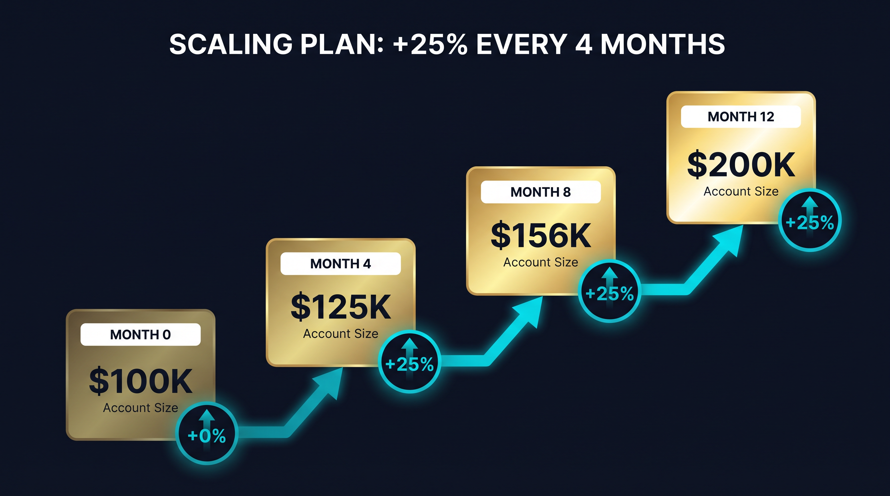

# Reseña FTMO 2026: 1-Step vs 2-Step, Reglas, Payouts y Plan de Scaling

*Última actualización: 17 de abril de 2026 — 15 min de lectura*


> **TL;DR** — FTMO es la Prop Firm multi-activo más grande del mundo, calificada con **4,8/5 en Trustpilot con más de 41.000 reseñas** y activa desde 2015. El plan de entrada en la cuenta de US$10K cuesta **€89**, el profit split es de **hasta 90%**, y la evaluación **no tiene límite de tiempo**. FTMO ahora ofrece dos rutas: el clásico **2-Step Challenge** (metas de 10% y luego 5%) y el más nuevo **1-Step Challenge** (meta única de 10% con un max loss más amplio de 10%). Las dos reglas que deciden el destino de la mayoría de los traders: el **5% de max daily loss** y el **10% de max loss overall**. Ambas se explican en detalle abajo.

| Datos Rápidos | |
|---|---|
| **Tipo de firma** | Prop Firm multi-activo (forex, índices, commodities, cripto, acciones, bonos) |
| **Fundada** | 2015 (Praga, República Checa) |
| **Productos** | FTMO Challenge 2-Step *o* FTMO Challenge 1-Step |
| **Tamaños de cuenta** | US$10K, US$25K, US$50K, US$100K, US$200K |
| **Precio de entrada (US$10K)** | €89 (único, reembolsable) |
| **Precio de entrada (US$100K)** | €540 (€439 en oferta actual) |
| **Meta de ganancia (2-Step)** | Fase 1: 10% · Fase 2: 5% |
| **Meta de ganancia (1-Step)** | Fase única: 10% |
| **Max daily loss** | 5% del balance inicial |
| **Max loss (overall)** | 10% (2-Step) / 10% (1-Step) |
| **Días mínimos de trading** | 4 días por fase |
| **Período de trading** | Ilimitado |
| **Profit split** | 80% base, hasta 90% vía Scaling/Premium |
| **Reembolso de cuota** | 100% con el primer retiro de recompensa |
| **Plataformas** | MetaTrader 4, MetaTrader 5, cTrader, DXtrade |
| **Swing Account** | Disponible (solo 2-Step) |
| **Trustpilot** | 4,8/5 (41.000+ reseñas) |
| **Clientes en todo el mundo** | 3,5M+ |
| **Total pagado a traders** | US$500M+ desde 2015 |

---

## ¿Qué es FTMO?

FTMO es una Prop Firm de evaluación con sede en Praga, República Checa, que ha estado operando desde 2015. Da a los traders minoristas una cuenta simulada para probar su habilidad, y los traders que aprueban la evaluación operan una cuenta demo fondeada donde su performance se replica en la operación de capital live de FTMO. Cada recompensa pagada al trader viene de los fondos propios de FTMO.

FTMO es la marca más grande en la industria de las Prop Firms por cantidad de clientes. A 2026 reporta más de **3,5 millones de clientes en todo el mundo**, con recompensas acumuladas pagadas superando los **US$500 millones**. Su página de Trustpilot tiene 41.000+ reseñas con un promedio de **4,8/5** — una de las señales públicas de confianza más fuertes del sector.

A diferencia de las firmas solo de futuros de EE.UU. (Apex, Bulenox, Take Profit Trader), FTMO es una operación **multi-activo**. Puedes operar pares de forex, índices principales (NAS100, SPX500, DAX, FTSE, Nikkei), commodities (XAU/USD, XAG/USD, WTI, Brent, gas natural), cripto (BTC, ETH y altcoins selectos como CFDs), acciones individuales como CFDs y bonos gubernamentales — todo desde una sola cuenta fondeada.

### Qué hace diferente a FTMO

Las tres cosas que diferencian a FTMO del resto del pack de Prop Firms:

1. **Track record.** Diez años operando, una de las únicas dos firmas que sobrevivió intacta al shakeout regulatorio MetaQuotes / EE.UU. de 2024
2. **Sin límite de tiempo en la evaluación.** Tienes tiempo ilimitado para alcanzar la meta de ganancia — la única presión de tiempo viene de tu propia disciplina
3. **Reembolso de cuota en el primer payout.** La cuota de entrada se devuelve al 100% cuando solicitas tu primer retiro de recompensa de la cuenta fondeada, haciendo que el costo efectivo de una evaluación exitosa sea cero

---

## Precios de FTMO (2026)

FTMO vende cinco tamaños de cuenta a través de dos productos (1-Step y 2-Step). Los precios están en Euros, se pagan una vez y se reembolsan completamente con tu primer payout de ganancias.

### Precios del FTMO 2-Step Challenge

| Cuenta | Cuota | Moneda |
|---|---|---|
| US$10.000 | €89 | USD, GBP, EUR |
| US$25.000 | €250 | USD, GBP, EUR |
| US$50.000 | €345 | USD, GBP, EUR |
| US$100.000 | **€439** (oferta) · €540 regular | USD, GBP, EUR |
| US$200.000 | €1.080 | USD, GBP, EUR |

La cuenta de US$100K se comercializa como el tier de "mejor valor" y actualmente está con descuento. También es el punto de entrada más popular para traders serios, ya que el plan de scaling topa en US$200K por cuenta y US$400K de exposición total.

### Precios del FTMO 1-Step Challenge

El 1-Step fue lanzado a finales de 2025 y usa el mismo esquema de cuotas. Eliges tu tamaño, pagas una vez, operas a través de una fase única de evaluación y pasas directo a la cuenta fondeada.

### Qué incluye cada cuenta FTMO

- Acceso completo a las plataformas (MT4, MT5, cTrader, DXtrade)
- Coach de performance personal
- Herramientas de análisis de operaciones (Account MetriX, Equity Simulator)
- Soporte de live chat 24/5 en 20 idiomas
- Free Trials ilimitadas antes de comprar
- Biblioteca de contenido educativo (FTMO Academy)

### Sin cuotas recurrentes

FTMO **no** cobra suscripciones mensuales, cuotas de data, cuotas de plataforma ni ningún costo recurrente. Tu cuota de evaluación es el costo total de tu bolsillo, y se reembolsa en tu primer payout exitoso — el costo neto de una evaluación aprobada es por lo tanto **cero**.

---

## 2-Step vs 1-Step Challenge: Cuál Elegir


Los dos formatos de challenge de FTMO existen porque los traders tienen psicologías diferentes. El 2-Step recompensa el trading disciplinado y multi-semana. El 1-Step recompensa la ejecución rápida y decidida.

### FTMO 2-Step Challenge (clásico)

Este es el producto original de FTMO. Operas a través de dos fases simuladas:

- **Fase 1 (Challenge):** Alcanza una **meta de ganancia del 10%**. Respeta el daily loss del 5% y el overall loss del 10%. Mínimo 4 días de trading.
- **Fase 2 (Verification):** Alcanza una **meta de ganancia del 5%**. Mismas reglas de drawdown. Mínimo 4 días de trading.

Solo después de pasar ambas FTMO te incorpora a una cuenta fondeada. La lógica detrás de la meta dividida es conservadora: la firma quiere ver que un trader que fue grande en la Fase 1 aún puede ser rentable a un ritmo más suave en la Fase 2. Filtra a los apostadores de un solo shot.

**El 2-Step es ideal para:** Traders que dimensionan conservadoramente, swing/position traders, cualquiera que nunca haya sido fondeado antes, y cualquiera que quiera acceso al tipo de cuenta FTMO Swing.

### FTMO 1-Step Challenge (nuevo, lanzado en 2025)

Una fase, un shot. Alcanzas la **meta de ganancia del 10%** una vez respetando las reglas de drawdown, y estás fondeado.

- **Fase única:** Alcanza una **meta de ganancia del 10%**.
- **Drawdown:** 5% daily loss, **10% max overall loss** (igual que el 2-Step).
- **Mínimo 4 días de trading.**
- **Sin fase de verificación.**

El 1-Step es más rápido para fondear pero tiene diferencias sutiles: sin opción de Swing Account, revisión de consistencia ligeramente más estricta en la etapa de funding, y toda la aprobación ocurre en una sola cuenta continua.

**El 1-Step es ideal para:** Traders intraday experimentados, scalpers que aprueban en menos de 2 semanas, traders con un edge probado que quieren fricción mínima.

### Comparación lado a lado

| Característica | 2-Step Challenge | 1-Step Challenge |
|---|---|---|
| Fases | 2 (Challenge + Verification) | 1 (solo Challenge) |
| Meta Fase 1 | 10% | 10% |
| Meta Fase 2 | 5% | — |
| Max daily loss | 5% | 5% |
| Max overall loss | 10% | 10% |
| Días mínimos de trading | 4 por fase (8 total) | 4 total |
| Límite de tiempo | Ilimitado | Ilimitado |
| Swing Account disponible | Sí | No |
| Profit split en cuenta fondeada | Hasta 90% | Hasta 90% |
| Cuota | Misma para ambos productos | Misma para ambos productos |
| Reembolso de cuota | 100% en primer payout | 100% en primer payout |

### ¿Cuál deberías elegir?

Elige **2-Step** si quieres la mayor flexibilidad (Swing Account, track record más largo de traders fondeados, camino "suave" más fácil). Elige **1-Step** si tienes un edge intraday que puedes probar en 4-10 sesiones y quieres llegar al capital rápidamente.

---

## Reglas de Evaluación (Trading Objectives)

FTMO llama a su set de reglas los "Trading Objectives." Estas son las restricciones duras que debes respetar durante la evaluación. Falla cualquiera y la cuenta se termina — sin reset a menos que vuelvas a comprar.

### Meta de ganancia

La meta de ganancia es el único objetivo que debe *alcanzarse*, no solo respetarse. Cada otro objetivo es un techo o un piso que no debes cruzar.

- **2-Step Fase 1:** 10% del balance inicial de la cuenta
- **2-Step Fase 2:** 5% del balance inicial de la cuenta
- **1-Step:** 10% del balance inicial de la cuenta

Para una cuenta de US$100.000, son US$10.000 en la Fase 1 y US$5.000 en la Fase 2 (2-Step), o US$10.000 en una sola fase (1-Step).

Alcanzas la meta cerrando posiciones a una ganancia acumulada igual o mayor a la meta. La ganancia no realizada no cuenta.

### Días mínimos de trading

**4 días por fase.** Un "día de trading" es cualquier día en que tengas al menos una posición abierta y cerrada. Los fines de semana demo y feriados bancarios no cuentan.

Esta regla existe para evitar que los traders aprueben con una sola operación de billete de lotería. Incluso si alcanzas la meta el día 1, tienes que operar 3 días más antes de poder enviarlo.

### Período de trading

**Ilimitado.** No hay fecha límite para aprobar la evaluación. Esta es una de las mayores ventajas estructurales de FTMO sobre firmas como Apex (límite de 30 días) o FundedNext (límite de 30-60 días). Puedes tomar meses si tu estrategia lo requiere.

### Hold de fin de semana y hold overnight

- **Cuentas normales:** Sin hold overnight hacia la apertura del lunes para posiciones que cruzan el fin de semana. Cierra todas las operaciones el viernes.
- **Swing Accounts:** El hold overnight y de fin de semana está permitido.

Esta es la principal diferencia operativa entre los dos tipos de cuenta.

### Regla de consistencia (implícita)

FTMO **no** tiene un porcentaje de consistencia hard-coded como la regla del 50% de Apex. Sin embargo, el proceso de revisión de la cuenta fondeada incluye un chequeo subjetivo de "trading según el mercado real": si tus resultados vienen abrumadoramente de una sola operación imprudente, el equipo de compliance puede marcar el payout. En la práctica, esto casi nunca se dispara para traders con riesgo normal (1-2% por operación) — solo atrapa a apostadores que arriesgan 10%+ en una sola posición.

---

## Reglas de Drawdown: Max Daily Loss y Max Total Loss


Las reglas de drawdown son la parte más malinterpretada de cualquier evaluación de Prop Firm. FTMO usa un sistema de drawdown **estático**, que es más amigable para los traders que uno trailing — pero igualmente castigador si dimensionas demasiado grande.

### Max Daily Loss (5%)

El Max Daily Loss es 5% del **balance inicial de la cuenta**. Para una cuenta de US$100K, eso son US$5.000. Esta regla aplica durante la evaluación **y** en la cuenta fondeada.

**Detalle clave:** el umbral se calcula sobre **equity**, no balance. Si tu balance es US$100.000 pero tienes una posición abierta mostrando una pérdida flotante de US$4.500, ya estás en -4,5% para el día. Un tick más abajo y la cuenta se termina.

El daily loss se resetea a **medianoche CET** (hora del servidor de Praga) cada día de trading.

### Max Loss (10%)

El Max Loss es 10% del balance inicial de la cuenta. Para una cuenta de US$100K, eso son US$10.000. Este umbral es **estático** — no sigue tu balance pico, no se actualiza cuando ganas. Se queda en `balance inicial − 10%` por toda la vida de la evaluación y la cuenta fondeada.

Para una cuenta de US$100K: `US$100.000 − US$10.000 = US$90.000`. Si tu equity alguna vez toca US$90.000, la cuenta se termina.

### Cómo interactúan los dos

El daily loss y el overall loss corren en paralelo. Rompes cualquiera que toques primero.

**Ejemplo — Día 1 en una cuenta de US$100K:**
- Inicio: US$100.000
- Equity a media jornada: US$95.500 (−4,5% desde el inicio)
- Otra pequeña operación perdedora: equity cae a US$95.000
- Daily loss: US$100.000 − US$95.000 = US$5.000 = **5,0% → ROTURA**

Misma cuenta, secuencia diferente:
- Cierre Día 1: US$103.000 (+3%)
- Cierre Día 2: US$92.000 (−11% desde el inicio)
- Overall loss: US$100.000 − US$92.000 = US$8.000 = **8,0% — aún OK en overall**
- Pero intraday en el Día 2 caíste de US$103K a US$92K = −10,7% en un día → **ROTURA de daily loss** disparada durante la sesión

### Por qué FTMO usa drawdown estático

El drawdown estático es más amigable que el trailing:
- Tu línea de max loss nunca sube a medida que ganas
- Puedes construir un buffer de ganancia y luego tomar mayor riesgo después sin que el drawdown se ajuste sobre ti
- Los errores tempranos en la evaluación duelen menos que en una cuenta trailing

El tradeoff es que la regla de daily loss es relativamente agresiva — 5% es más apretado de lo que la mayoría de firmas permiten en el daily. Esto recompensa a los traders que respetan el position sizing y castiga el revenge trading.

---

## Cuenta Fondeada FTMO y Plan de Scaling

Después de que apruebas la evaluación (ya sea 2-Step o 1-Step), FTMO configura una **cuenta fondeada simulada** con tu capital inicial. Firmas el FTMO Account Agreement, completas la verificación FTMO Identity, y estás autorizado para operar.

### Cómo funciona la cuenta fondeada

Técnicamente, la FTMO Account es una cuenta demo simulada. FTMO toma tus operaciones como señales y las replica en mercados reales usando el capital propio de la firma. Tu recompensa es una parte de las ganancias generadas en ese book replicado.

- **Capital inicial:** Mismo tamaño que tu evaluación (US$10K–US$200K)
- **Profit split:** 80% base. Sube a 90% vía el Plan de Scaling o el Premium Programme
- **Reglas de drawdown en la cuenta fondeada:** Mismo 5% daily / 10% max loss (absoluto, calculado desde el balance inicial)
- **Período de trading:** Indefinido — la cuenta permanece activa mientras respetes las reglas y muestres actividad regular
- **Actividad mínima:** Al menos una operación cada 30 días

### El Plan de Scaling (+25% cada 4 meses)



FTMO recompensa a los traders consistentes con un **upgrade automático del tamaño de cuenta cada 4 meses** — asumiendo que cumples los requisitos:

- **Requisito:** Mínimo **10% de ganancia acumulada** en tu cuenta FTMO a través de los últimos 4 meses
- **Requisito:** Al menos 2 de los últimos 4 meses deben ser rentables
- **Upgrade:** **+25% del balance original** añadido a la cuenta
- **Upgrade de profit split:** Aumentado de 80% a 90%
- **Tope:** Los upgrades continúan hasta que la cuenta alcance **US$400.000 de capital total**

**Ejemplo de progresión en una cuenta de US$100K:**

| Mes | Tamaño de Cuenta | Crecimiento Acumulado |
|---|---|---|
| 0 | US$100.000 | Inicio |
| 4 | US$125.000 | +25% |
| 8 | US$150.000 | +50% |
| 12 | US$175.000 | +75% |
| 16 | US$200.000 | +100% |

Después de eso, puedes continuar escalando hacia el tope de US$400K vía el Premium Programme (tiers Prime y Supreme).

### Premium Programme (Prime y Supreme)

Prime y Supreme son programas de recompensa por tier para traders FTMO de alto performance. Vienen con upgrades de profit split, gerentes de cuenta dedicados, acceso directo vía Telegram a analistas senior e invitaciones a eventos exclusivos.

- **Prime:** Requiere rentabilidad consistente durante 4+ meses y un tamaño mínimo de cuenta
- **Supreme:** Top 1% de los traders FTMO, requiere payouts sostenidos de US$100K+

---

## Plataformas de Trading

FTMO soporta cuatro plataformas. Tu elección es permanente para la vida de esa cuenta de evaluación — no puedes cambiar a mitad de challenge.

### MetaTrader 4 (MT4)

El estándar de la industria para traders de forex en todo el mundo. Aún muy usado para EAs (expert advisors) legacy e indicadores custom construidos en el lenguaje MQL4.

**Bueno para:** Forex, metales preciosos, la mayoría de estrategias algorítmicas
**Menos ideal para:** Activos cripto modernos, tipos de órdenes avanzados

### MetaTrader 5 (MT5)

La plataforma MetaQuotes más nueva con soporte multi-activo completo, ejecución más rápida y gestión de órdenes más avanzada. La mayoría de los nuevos traders FTMO optan por defecto a MT5.

**Bueno para:** Trading multi-activo (forex + índices + acciones + cripto), desarrollo algo moderno (MQL5)
**Menos ideal para:** Traders con grandes codebases legacy MQL4

### cTrader

Una alternativa más limpia y moderna a MetaTrader. Popular entre los scalpers de forex por spreads más apretados y datos avanzados de Level 2 depth-of-market. Usa cBots (no EAs) para automatización.

**Bueno para:** Scalpers, cualquiera que deteste la UI de MetaTrader, traders manuales profesionales
**Menos ideal para:** Cualquiera con estrategias MQL existentes

### DXtrade

La adición de plataforma más nueva de FTMO. Basada en web, totalmente responsive, sin instalación de software. Conceptualmente similar a Tradovate en el lado de futuros.

**Bueno para:** Traders que quieren acceso zero-install vía browser, flujos de trading pesados en móvil
**Menos ideal para:** Usuarios pesados de algo (ecosistema de scripting limitado hasta ahora)

---

## Cuenta Normal vs Swing Account

FTMO ofrece dos tipos de cuenta en el producto 2-Step. La Swing Account está diseñada para traders que quieren mantener posiciones a través de releases de noticias y a través de fines de semana.

### Cuenta normal

- **Spreads estándar** (entre los más apretados del prop trading)
- **Sin hold de fin de semana** — todas las posiciones deben cerrarse antes del cierre de mercado del viernes
- **Trading restringido durante noticias de alto impacto** (2 minutos antes y después, específico por divisa)
- **Comisión más baja** en pares de forex

### Swing Account

- **Spreads más amplios** (aproximadamente 1,5–2× los spreads de Normal)
- **Las posiciones pueden mantenerse durante fines de semana**
- **News trading permitido sin restricción** (sin blackout de 2 minutos)
- **Mismas metas de ganancia y reglas de drawdown que Normal**
- **Disponible solo en 2-Step** — el 1-Step no tiene variante Swing

La Swing Account es la elección correcta para cualquier trader cuya estrategia requiera mantener posiciones a través de NFP, CPI, FOMC, o mantener operaciones abiertas de viernes a lunes. El spread más amplio es el costo de la flexibilidad operativa.

---

## Sistema de Payout de FTMO

FTMO tiene uno de los mecanismos de payout más limpios de la industria, con un track record de más de US$500M pagados desde 2015.

### Frecuencia de payout

- **Primer payout:** Disponible después de **14 días** de trading en la cuenta fondeada (período mínimo de hold)
- **Payouts subsiguientes:** On-demand, con un mínimo de 14 días entre cada solicitud de payout
- **Tu elección de cronograma:** Tú fijas tu propio día de payout — FTMO no lo dicta

### Profit split

- **80% base** en la cuenta fondeada
- **90%** después del primer hito del Plan de Scaling o Prime Status
- **100% de tus ganancias durante Free Trial y evaluación** (lo cual es académico — esas son solo simuladas, no pagadas)

### Métodos de payout

| Método | Velocidad | Mínimo |
|---|---|---|
| **Transferencia bancaria** | 1–3 días hábiles | Ninguno |
| **Rise (instantáneo)** | Horas | Ninguno |
| **Skrill** | Horas a 1 día | Ninguno |
| **Criptomoneda (USDT, USDC, BTC)** | Horas | Ninguno |
| **Deel / contractor** | 1–2 días hábiles | Ninguno |

Las recompensas pueden pagarse en EUR, USD, GBP o criptomonedas selectas. La operación de recompensa de FTMO es independiente de la plataforma de trading, así que un delay con los servidores de MT4/MT5 no retrasa tu retiro.

### El reembolso 100% de la cuota

**Tu cuota de entrada se reembolsa 100% con tu primer payout.** Si pagaste €540 por la cuenta de US$100K y tu primer payout es de US$2.000, FTMO te envía los US$2.000 más los €540 de vuelta. Esto hace que el costo neto de una evaluación aprobada sea **cero**.

### Payout máximo

**No hay tope duro** en un solo payout, y no hay límite en el número de payouts por cuenta. El único throttle es el mínimo de 14 días entre retiros.

---

## Qué Puedes Operar en FTMO

FTMO ofrece uno de los sets de instrumentos más amplios del prop trading. Todas las operaciones se ejecutan como CFDs o posiciones simuladas equivalentes a spot.

### Forex

Todos los pares mayores (EUR/USD, GBP/USD, USD/JPY, AUD/USD, USD/CAD, USD/CHF, NZD/USD), todos los cruces (EUR/GBP, GBP/JPY, etc.) y más de 15 pares de mercados emergentes (USD/ZAR, USD/MXN, USD/TRY, USD/CNH).

### Índices

- **NAS100** (Nasdaq 100)
- **SPX500** (S&P 500)
- **US30** (Dow Jones)
- **GER40 / DAX**
- **UK100 / FTSE 100**
- **JPN225 / Nikkei**
- **HK50** (Hang Seng)
- **AUS200** (ASX 200)

### Commodities

- **Oro (XAU/USD)**, **Plata (XAG/USD)**
- **WTI Crude (USOIL)**, **Brent Crude (UKOIL)**
- **Gas Natural (NGAS)**
- **Cobre, Platino, Paladio**

### Cripto (CFD)

BTC/USD, ETH/USD, XRP/USD, LTC/USD, ADA/USD, SOL/USD, DOT/USD, DOGE/USD y un puñado de altcoins. Los spreads son más amplios que en el forex mayor.

### Acciones (CFD)

Más de 50 acciones large-cap de EE.UU. (AAPL, MSFT, NVDA, TSLA, META, GOOGL, AMZN, etc.) y nombres europeos selectos. Solo ejecución CFD — sin propiedad real de acciones.

### Bonos

Treasury de EE.UU. a 10 años, Bund alemán, Gilts del Reino Unido — principalmente para traders macro.

---

## Estrategias Prohibidas

FTMO es más estricta que las firmas de futuros de EE.UU. en cuanto al tipo de trading permitido. Violar cualquiera de estas reglas resulta en terminación sin reembolso.

- **Arbitraje de latencia** (explotar feeds de precio lentos)
- **Tick-scalping / scalping de 1 segundo** al azar (scalping con una estrategia real está bien)
- **Trading grupal** (misma estrategia ejecutada simultáneamente en múltiples cuentas por diferentes personas)
- **Hedging entre cuentas** (abrir posiciones opuestas en dos cuentas FTMO)
- **Copy trading de un servicio de señales de terceros** (tu propio copy trading entre tus propias cuentas FTMO está permitido, sujeto a la revisión de consistencia)
- **HFT / scalping automatizado con tiempos de hold bajo 5 segundos**
- **Riesgo tipo gambling (30%+ de la cuenta en una sola operación)**

El news trading está **permitido** en Swing Accounts. En Cuentas Normales está restringido por 2 minutos antes y después del release.

---

## Pros y Contras de FTMO


### Pros

- **Track record más largo** de la industria (desde 2015, US$500M+ pagados a traders)
- **4,8/5 Trustpilot con 41.000+ reseñas** — la calificación de confianza más alta de cualquier Prop Firm
- **Reembolso 100% de la cuota** en el primer payout — costo neto de una evaluación aprobada es cero
- **Tiempo ilimitado** para aprobar la evaluación — sin fecha límite artificial
- **Multi-activo** (forex, índices, commodities, cripto, acciones, bonos en una cuenta)
- **Hasta 90% de profit split** vía el Plan de Scaling
- **+25% de scaling automático cada 4 meses** en cuentas consistentes
- **Cuatro plataformas soportadas** — MT4, MT5, cTrader, DXtrade
- **Opción de Swing Account** para traders de noticias y traders de posición
- **Live chat 24/5 en 20 idiomas** — una de las mejores operaciones de soporte del prop trading

### Contras

- **Cuota de entrada más alta** que las firmas de futuros de EE.UU. (€89 por US$10K vs US$19,90 en Apex 25K)
- **5% daily loss sobre equity** es apretado — las pérdidas flotantes cuentan, así que estrategias volátiles son stopeadas más rápido
- **Sin descuento Lifetime en efectivo** — ofertas ocasionales pero sin programa de cupón rodante
- **El 2-Step toma más tiempo** — 8 días mínimos de trading vs 4 en 1-Step (o 1 día mínimo en Apex)
- **Revisión estricta de "trading según mercado real"** — chequeo de compliance subjetivo antes del primer payout en cuentas marcadas
- **Acceso limitado a EE.UU.** — FTMO no incorpora traders de todos los estados de EE.UU. debido a restricciones regulatorias
- **Solo CFD para acciones y cripto** — sin propiedad real de activo, aplican funding fees en holds overnight
- **La Cuenta Normal prohíbe hold de fin de semana y news** — Swing requerido para esos estilos (cuesta spread más amplio)

---

## ¿Para Quién es Mejor FTMO?

**1. Traders de forex y multi-activo**
Si tu edge está en EUR/USD, GBP/JPY, XAU/USD o NAS100, FTMO es la elección obvia. Ninguna firma de futuros de EE.UU. compite en amplitud de forex.

**2. Traders que necesitan tiempo ilimitado de evaluación**
Apex te da 30 días. FundedNext te da 30-60 días. FTMO te da *para siempre*. Si tu estrategia es de quema lenta o basada en posición, esto es decisivo.

**3. Traders que quieren la firma más segura de la industria**
Diez años de operación, números de ganancias públicos, auditada por EY, destacada por Forbes. FTMO tiene la confianza institucional más fuerte de cualquier Prop Firm.

**4. Traders apuntando al Plan de Scaling**
El +25% automático cada 4 meses es un camino genuino a capital de US$200K-US$400K. Ninguna otra firma mayor tiene una regla de scaling automático tan predecible.

**Quién debería mirar en otro lado:**

- Si operas futuros (ES, NQ, CL, GC) — FTMO no ofrece futuros reales, solo CFDs de índice. Ve con Apex o Bulenox
- Si quieres el punto de entrada más barato — Apex con el cupón MARKET es más barato en el US$25K
- Si no quieres ninguna revisión de consistencia — las versiones anteriores de FundingPips o The5ers tienen gates de compliance más flojos
- Si estás basado en ciertos estados de EE.UU. — revisa la lista de jurisdicciones de FTMO antes de comprar

---

## FTMO vs Otras Prop Firms

Una breve comparación contra las firmas que probablemente también estás evaluando:

| Firma | Evaluación | Profit Split | Drawdown | Límite de Tiempo | Ideal Para |
|---|---|---|---|---|---|
| **FTMO** | 1-Step o 2-Step | Hasta 90% | 5% DD / 10% max estático | Ilimitado | Forex, multi-activo |
| **Apex Trader Funding** | 1-Step | 100% (simulado) | Trailing (−5%) o EOD | 30 días | Scalpers de futuros de EE.UU. |
| **Take Profit Trader** | 1-Step | Hasta 90% | Trailing EOD | Ilimitado | Swing de futuros |
| **FundedNext** | 1-Step, 2-Step o Evaluation Pro | Hasta 95% | 5% DD / 10% max | 30-60 días | Forex + cripto |
| **The5ers** | Instant Funding o Bootcamp | 50-100% | Estático | Ilimitado | Principiantes conservadores |
| **Bulenox** | 1-Step | 90% | Estático | Ilimitado | Futuros de EE.UU., news |
| **FundingPips** | 2-Step | Hasta 90% | 5% DD / 10% max | Ilimitado | Forex, entrada de bajo costo |

### FTMO vs FundedNext

Ambas apuntan al mismo cliente (retail multi-activo de forex). FundedNext es más barata en la entrada (US$99 por US$15K vs €89 por US$10K) y tiene un techo de split más alto (95% vs 90%). FTMO gana en track record, elección de plataformas y claridad del plan de scaling. Si es tu primera cuenta fondeada, FTMO es la apuesta más segura.

### FTMO vs Apex

Clases de activo diferentes, así que no compiten directamente. Si eres trader de futuros, Apex es el default. Si operas forex o índices, FTMO es el default. Un pequeño número de traders corre ambos simultáneamente — Apex para scalping de ES/NQ en sesión de EE.UU. y FTMO para swing overnight de EUR/USD.

### FTMO vs FundingPips

FundingPips (propiedad de la compañía matriz de FundedNext, 2025+) ofrece una estructura 2-step similar a un precio más bajo. El tradeoff es historial operativo más corto (lanzada en 2022 vs 2015 de FTMO) y soporte menos maduro. Para capital fondeado serio a largo plazo, FTMO es la elección más segura.

---

## Preguntas Frecuentes sobre FTMO

**¿FTMO es confiable?**
Sí. FTMO opera desde 2015, ha pagado más de US$500M en recompensas, mantiene 4,8/5 en Trustpilot con más de 41.000 reseñas y ha sido destacada por Forbes, EY y los Financial Magnates awards. Es la Prop Firm más establecida de la industria.

**¿Cuánto toma aprobar el FTMO Challenge?**
El mínimo son 4 días de trading por fase (así que 8 días de trading para el 2-Step, 4 para el 1-Step). En la práctica, la mayoría de los traders que aprueban toman 2–6 semanas en el 2-Step y 1–3 semanas en el 1-Step.

**¿Qué pasa si fallo el FTMO Challenge?**
La cuenta se termina y la cuota se pierde. Puedes comprar un nuevo challenge en cualquier momento — FTMO no restringe intentos repetidos. No hay opción oficial de "reset", pero la cuota es lo suficientemente baja como para que comprar un challenge fresco típicamente sea más barato que un reset en muchas otras firmas.

**¿Puedo usar expert advisors (EAs) en FTMO?**
Sí, en MT4 y MT5. Copy trading de un servicio de señales pagado no está permitido, pero tus propios EAs y tu propio copy trading entre tus propias cuentas FTMO están ambos permitidos.

**¿Hay límite de tiempo en el FTMO Challenge?**
No. El Período de Trading es **ilimitado**. Puedes tomarte todo el tiempo que necesites para alcanzar la meta de ganancia.

**¿Puedo operar noticias en FTMO?**
Sí en la Swing Account. En la Cuenta Normal, hay un blackout de 2 minutos antes y después de los releases de noticias mayores en la divisa relevante. Operar fuera de esa ventana está bien.

**¿Puedo mantener posiciones durante el fin de semana?**
Solo en la **Swing Account** (producto 2-Step). Las Cuentas Normales deben cerrar todas las posiciones antes del cierre de mercado del viernes.

**¿Qué es el plan de scaling de FTMO?**
Cada 4 meses, si tienes al menos 10% de ganancia acumulada con al menos 2 meses rentables en ese período, FTMO automáticamente aumenta tu cuenta en 25% del balance original y sube tu profit split a 90%. El scaling continúa hasta que tu cuenta alcance US$400.000.

**¿El reembolso de cuota de FTMO aplica a cada challenge?**
El reembolso 100% de cuota aplica **una vez por challenge aprobado exitosamente**, disparado por tu primer retiro de recompensa en la cuenta fondeada resultante. Si fallas un challenge y compras uno nuevo, esa nueva cuota es un costo separado.

**¿Puedo tener más de una cuenta FTMO?**
Sí. FTMO te permite mantener múltiples cuentas simultáneamente, hasta una asignación de capital combinada máxima de **US$400.000**. Puedes mezclar cuentas 1-Step y 2-Step en cualquier combinación.

**¿FTMO está disponible en Estados Unidos?**
FTMO tiene una operación específica para EE.UU. (FTMO US) para ciertos estados. La entidad global de FTMO no incorpora traders retail de EE.UU. en estados restringidos. Revisa la página de jurisdicción de FTMO antes de comprar.

**¿Cuánto puedo ganar en FTMO?**
No hay tope en las ganancias. Tu porcentaje del 80-90% aplica a cada dólar generado. Los traders en el top de la distribución de FTMO han recolectado recompensas anuales de varios cientos de miles de dólares.

**¿Qué es el FTMO Discipline Score?**
Una métrica propietaria que evalúa tu comportamiento de gestión de riesgo durante la evaluación. Es solo informativa — no bloquea aprobaciones — pero se usa para calificación del Premium Programme.

**¿FTMO paga dinero real o simulado?**
Dinero real. Las ganancias generadas en la cuenta fondeada simulada se pagan desde el capital real de FTMO vía transferencia, Rise, Skrill, Deel o criptomoneda.

---

## Cómo Empezar en FTMO: Walkthrough de 8 Pasos

**Paso 1 — Prueba primero la Free Trial.**
FTMO ofrece una Free Trial ilimitada. Tómate al menos 5 días de trading en ella para familiarizarte con spreads, ejecución y quirks de plataforma antes de pagar por el challenge real.

**Paso 2 — Elige tu producto (1-Step o 2-Step).**
Si eres un trader swing o position disciplinado, elige 2-Step. Si eres un scalper intraday experimentado que quiere fricción mínima, elige 1-Step.

**Paso 3 — Elige tu tamaño de cuenta.**
El tier de US$100K tiene el mejor balance de presupuesto de riesgo y precio accesible. El tier de US$10K es el punto de entrada más barato a €89 — ideal si quieres probar tu estrategia en FTMO antes de escalar capital.

**Paso 4 — Elige tu plataforma.**
MT5 es el default más seguro. Elige MT4 solo si tienes EAs legacy. Elige cTrader si eres scalper de spread apretado. Elige DXtrade si quieres acceso solo por browser.

**Paso 5 — Elige Normal o Swing.**
Swing si mantienes posiciones overnight u operas noticias. Normal si cierras todo intraday. Swing es solo en el 2-Step.

**Paso 6 — Completa el KYC (FTMO Identity).**
Sube prueba de ID y prueba de dirección. Este es un requisito duro antes de tu primer payout. Hazlo temprano — la verificación puede tomar 24-72 horas.

**Paso 7 — Opera la evaluación.**
Mantente en riesgo de 1-2% por operación. Respeta el cap diario de 5% religiosamente — es la causa #1 de fallo de evaluación. No persigas la meta de ganancia; deja que venga a ti.

**Paso 8 — Aprueba, activa y solicita tu primer payout después de 14 días.**
Una vez que pases la(s) evaluación(es), firma el FTMO Account Agreement, espera 14 días en la cuenta fondeada y envía tu primer retiro. Tu reembolso 100% de cuota viene con él.

---

## Veredicto Final

FTMO es el estándar de oro del prop trading, punto. Tiene el historial operativo más largo, la calificación de Trustpilot más alta, la lista de instrumentos más amplia, la mejor elección de plataforma y el plan de scaling más generoso de la industria. No es la más barata, y no es la más rápida para aprobar — pero es el hogar a largo plazo más seguro para el capital fondeado de un trader serio.

La debilidad de FTMO es que sus gates de disciplina son genuinos: un 5% daily loss sobre equity es apretado, la revisión de consistencia en la etapa de funding es real y el acceso a EE.UU. es limitado. Ninguno de estos son deal-breakers para un trader disciplinado, pero son deal-breakers para apostadores — lo cual es por diseño.

Para traders de forex y multi-activo buscando su primera (o mejor) cuenta fondeada, FTMO es la recomendación por default. Para traders de futuros de EE.UU., Apex es el default correcto. Para cualquiera en cualquier parte del espectro, hacer la Free Trial antes de pagar es la acción de mayor ROI.

---

## Guías Relacionadas

- [Reseña Apex Trader Funding 2026](./apex-trader-funding-review) — contraparte de futuros de EE.UU., entrada más barata, 100% de split
- [Reseña Take Profit Trader 2026] — futuros de EE.UU., evaluación ilimitada, estilo similar al EOD de Apex
- [Reseña FundedNext 2026] — competidor multi-activo más cercano de FTMO, techo de profit split más alto
- [Reseña Bulenox 2026] — alternativa de futuros con drawdown estático frente a Apex

---

```html
<script type="application/ld+json">
{
  "@context": "https://schema.org",
  "@type": "Review",
  "itemReviewed": {
    "@type": "Organization",
    "name": "FTMO",
    "url": "https://ftmo.com",
    "logo": "https://ftmo.com/logo.png"
  },
  "author": {
    "@type": "Organization",
    "name": "Markets Coupons"
  },
  "reviewRating": {
    "@type": "Rating",
    "ratingValue": "4.8",
    "bestRating": "5",
    "reviewCount": "41685"
  },
  "inLanguage": "es",
  "datePublished": "2026-04-17"
}
</script>
```
