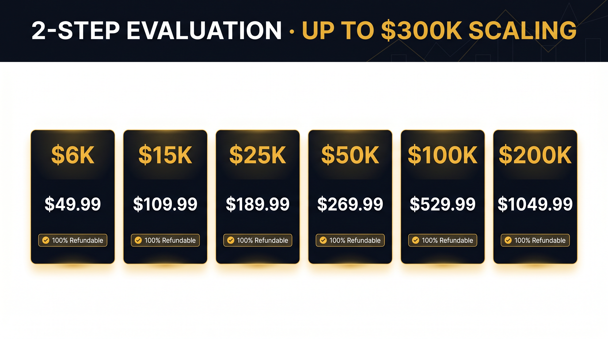

# Avis FundedNext 2026 : Le Stellar Challenge en Vaut-il la Peine ?

*Dernière mise à jour : 17 avril 2026 · 14 min de lecture · Par Markets Coupons Team*


FundedNext est l'une des plus grandes Prop Firms forex et CFD au monde, avec **plus de 288,4 millions de US$ versés aux traders** et plus de **64 941 avis vérifiés sur Trustpilot à une moyenne de 4,5 étoiles**. Lancée en 2022, la firme a bâti sa réputation sur la transparence des règles, la rapidité des payouts et le Stellar Challenge — une évaluation 2-step devenue une référence dans l'espace forex prop.

Si vous venez d'un univers futures (Apex, Bulenox, Take Profit Trader) ou d'une firme 2-step classique comme FTMO, FundedNext vous donne accès au **forex, métaux, indices, pétrole et crypto** avec jusqu'à **300 000 US$ de buying power** et un **Profit Split de 95 %** avec l'add-on Stellar Lifetime.

Ce guide couvre **toutes les règles, tous les prix, tous les frais et tous les cas limites** à connaître avant de payer un compte Stellar Challenge — plus une analyse honnête des avantages, inconvénients et une comparaison FundedNext vs FTMO et autres Prop Firms forex.

> **Résumé rapide**
> **Type :** Prop Firm forex & CFD (2-step, 1-step et instant funding disponibles)
> **Idéal pour :** Traders swing et intraday forex qui souhaitent tenir le week-end, trader les news et scaler haut
> **Profit Split :** Jusqu'à 95 % avec l'add-on Stellar Lifetime Reward (80 % par défaut → 90 % après scaling)
> **Funding max :** 200 000 US$ par compte, scaling jusqu'à 300 000 US$
> **Drawdown :** 10 % max global / 5 % quotidien (statique, basé sur le solde initial)
> **Trustpilot :** ★ 4,5 · 64 941 avis
> **Offre active :** Frais 100 % remboursables sur le Stellar 2-Step — vous payez une fois et récupérez le montant avec votre premier payout

---

## Table des matières

1. [Qu'est-ce que FundedNext ?](#what-is-fundednext)
2. [Comment fonctionne le Stellar Challenge](#how-the-stellar-challenge-works)
3. [Types de Challenge : 2-Step vs 1-Step vs Lite](#challenge-types)
4. [Tarifs FundedNext (toutes les tailles de compte)](#pricing)
5. [Les phases du 2-Step expliquées](#phases-explained)
6. [Règles de Drawdown (10 % max / 5 % quotidien)](#drawdown)
7. [Profit Split et calendrier des payouts](#profit-split)
8. [Add-ons : Lifetime Reward, 150 %, Double Up](#add-ons)
9. [Plan de scaling : de 6 000 US$ à 300 000 US$](#scaling)
10. [Règles de trading et stratégies interdites](#rules)
11. [Plateformes : MT4, MT5, cTrader, Match-Trader](#platforms)
12. [FundedNext vs FTMO : laquelle choisir ?](#vs-ftmo)
13. [Avantages et inconvénients](#pros-cons)
14. [Questions fréquentes](#faq)

---

## <a id="what-is-fundednext"></a>Qu'est-ce que FundedNext ?

FundedNext est une Prop Firm basée aux Émirats arabes unis, lancée en 2022, qui propose du capital simulé aux traders retail. Après avoir réussi une évaluation (le Stellar Challenge), le trader accède à un compte « funded » et conserve un pourcentage des profits générés sur ce compte.

La firme propose trois structures de challenge distinctes : **Stellar 2-Step** (le produit phare), **Stellar 1-Step** (évaluation en une seule phase) et **Stellar Lite** (un 2-step simplifié aux règles plus souples). Les trois mènent au même objectif — un compte funded avec payouts bihebdomadaires et potentiel de scaling.

Les chiffres clés qui définissent FundedNext en 2026 :

- **288,4 M+ US$** de payouts totaux versés aux traders
- **64 941** avis Trustpilot à 4,5 étoiles
- **5,44 M+ US$** de volume quotidien tradé sur les comptes funded
- **3 jours** en moyenne pour traiter un payout (garantie 24 heures sur le Stellar 2-Step)
- **100 %** de frais remboursables — vous récupérez le coût du challenge avec votre premier payout

Contrairement aux firmes futures (Apex, Bulenox), FundedNext se concentre sur le **forex, les matières premières, les indices et la crypto** — le mix CFD classique — et le trading se fait sur MetaTrader 4/5, cTrader ou Match-Trader plutôt que NinjaTrader ou Tradovate.

---

## <a id="how-the-stellar-challenge-works"></a>Comment fonctionne le Stellar Challenge

Le Stellar Challenge est le tunnel d'évaluation de FundedNext. Voici la version en 30 secondes :

1. **Payer les frais du challenge** (selon la taille du compte — de 49,99 US$ pour un compte 6K à 1 049,99 US$ pour un compte 200K).
2. **Réussir la Phase 1** — atteindre 8 % de profit sans enfreindre le drawdown max de 10 % ni la perte quotidienne de 5 %.
3. **Réussir la Phase 2** — atteindre un objectif plus modeste de 5 % sous les mêmes règles de drawdown.
4. **Recevoir le compte funded** — trader votre stratégie, être payé tous les 14 jours, conserver 80 % → 90 % des profits.
5. **Scaler** — ajouter 50 000 US$ de buying power tous les 4 mois jusqu'au plafond de 300 000 US$.

L'ensemble du tunnel tourne sur un serveur démo live (exécution simulée, données de marché réelles), donc vous ne risquez aucun capital personnel sur l'évaluation — seulement les frais du challenge, qui sont **100 % remboursables avec votre premier payout**.

---

## <a id="challenge-types"></a>Types de Challenge : 2-Step vs 1-Step vs Lite


FundedNext commercialise actuellement trois modèles de challenge. Le bon choix dépend de votre style de trading, votre appétit pour le risque et la vitesse à laquelle vous voulez devenir funded.

### Stellar 2-Step (produit phare)

L'évaluation classique. Deux phases, objectifs 8 % et 5 %, drawdown global 10 %, drawdown quotidien 5 %. **Jours de trading illimités, aucun minimum** — vous pouvez passer les deux phases en une semaine en étant agressif. Option la plus populaire, qui inclut les frais 100 % remboursables + le payout garanti en 24 heures avec bonus de 1 000 US$ si FundedNext manque le délai.

### Stellar 1-Step

Évaluation en une seule phase avec un objectif de profit plus élevé (généralement 10 %) mais sans deuxième phase à passer. Chemin plus rapide vers le funded mais profil de drawdown plus serré (généralement 6 % max et 3 % quotidien). Idéal pour les swing traders qui veulent un minimum d'administratif.

### Stellar Lite

Un 2-step plus souple destiné aux débutants : objectifs de profit plus bas, drawdowns légèrement plus serrés, frais moins chers. Pas de frais 100 % remboursables, pas de payout garanti en 24 heures. Voyez-le comme la version « petites roues » du Stellar 2-Step.

| Challenge | Profit target | DD max | DD quotidien | Frais remboursables | Idéal pour |
|---|---|---|---|---|---|
| **Stellar 2-Step** | 8 % + 5 % | 10 % | 5 % | **Oui — 100 %** | La plupart des traders |
| **Stellar 1-Step** | 10 % | 6 % | 3 % | Non | Swing traders |
| **Stellar Lite** | 6 % + 4 % | 8 % | 4 % | Non | Débutants |

Pour le reste de cet avis, nous nous concentrerons sur le **Stellar 2-Step** car c'est le produit le plus populaire et celui auquel s'applique le payout garanti en 24 heures.

---

## <a id="pricing"></a>Tarifs FundedNext (toutes les tailles de compte)

FundedNext utilise des frais fixes uniques par compte challenge (pas d'abonnement mensuel comme Apex). Voici les prix Stellar 2-Step en avril 2026 :

| Taille du compte | Frais du challenge | Perte max (US$) | Perte quotidienne (US$) | Target Phase 1 | Target Phase 2 |
|---|---|---|---|---|---|
| **6 000 US$** | 49,99 US$ | 600 US$ | 300 US$ | 480 US$ | 300 US$ |
| **15 000 US$** | 109,99 US$ | 1 500 US$ | 750 US$ | 1 200 US$ | 750 US$ |
| **25 000 US$** | 189,99 US$ | 2 500 US$ | 1 250 US$ | 2 000 US$ | 1 250 US$ |
| **50 000 US$** | 269,99 US$ | 5 000 US$ | 2 500 US$ | 4 000 US$ | 2 500 US$ |
| **100 000 US$** | 529,99 US$ | 10 000 US$ | 5 000 US$ | 8 000 US$ | 5 000 US$ |
| **200 000 US$** | 1 049,99 US$ | 20 000 US$ | 10 000 US$ | 16 000 US$ | 10 000 US$ |

Le palier 6K est conçu comme point d'entrée économique — idéal pour les traders qui veulent tester le Stellar Challenge avant de miser 500+ US$ sur un 100K. Le 200K est la plus grande taille de départ ; à partir de là, le scaling vous emmène jusqu'à 300K.

**Mécanique des frais remboursables :** l'intégralité des frais du challenge vous est créditée avec votre **premier payout** sur le compte funded. Donc si vous payez 529,99 US$ pour le 100K et gagnez votre premier payout de 3 000 US$, vous recevez en réalité **3 529,99 US$** — le profit plus vos frais initiaux.

---

## <a id="phases-explained"></a>Les phases du 2-Step expliquées


Le Stellar 2-Step comporte deux phases séquentielles. Vous devez réussir la Phase 1 pour débloquer la Phase 2, et réussir la Phase 2 pour devenir funded.

### Phase 1 : le target de 8 %

- **Profit target :** 8 % du solde initial
- **Drawdown max global :** 10 % du solde initial (statique, basé sur le solde)
- **Drawdown max quotidien :** 5 % du solde initial (reset à 00:00 GMT+3)
- **Jours de trading minimum :** 0 (aucun minimum — passez aussi vite que vous voulez)
- **Limite de temps :** Illimitée

Réussissez la Phase 1 et vous passez automatiquement en Phase 2 sur un nouveau compte démo avec le même solde.

### Phase 2 : le target de 5 %

- **Profit target :** 5 % du solde initial
- **Drawdowns :** Identiques à la Phase 1 (10 % max / 5 % quotidien)
- **Jours de trading minimum :** 0
- **Limite de temps :** Illimitée

Réussissez la Phase 2 et, dans un délai de 24 à 48 heures, FundedNext émet votre compte funded. Pas de salle d'attente, pas de révision manuelle pour les passes normaux.

### Ce que signifie « Drawdown statique »

FundedNext utilise un **Drawdown statique basé sur le solde**, pas de trailing. Sur un compte de 100K, le plancher de 10 % est à 90 000 US$ — et il reste à 90 000 US$ pour toujours, peu importe combien de profit vous faites. Une fois rentable, le coussin effectif grandit à chaque trade gagnant.

C'est un gros avantage par rapport aux firmes à trailing drawdown (Apex, TPT intraday), où les profits poussent le drawdown vers le haut et le plancher vous suit à mesure que vous grandissez.

---

## <a id="drawdown"></a>Règles de Drawdown (10 % max / 5 % quotidien)

Deux règles mettront fin instantanément à votre challenge ou compte funded :

### 1. Drawdown max global — 10 %

L'equity ne peut jamais descendre en dessous de 90 % du solde initial. Sur un compte 100K, le plancher dur est à **90 000 US$**. Atteignez-le en intraday ou à la clôture et le compte est terminé. C'est statique — cela ne monte pas avec les profits.

### 2. Drawdown max quotidien — 5 %

À partir de l'equity de fin de journée à 00:00 GMT+3, votre equity ne peut pas chuter de plus de 5 %. Sur un compte 100K avec une clôture à 102 000 US$ la veille, le plancher du jour est à **102 000 US$ − 5 000 US$ = 97 000 US$**. Atteignez-le et le compte est terminé.

**Les pertes flottantes comptent.** FundedNext mesure l'equity en temps réel, positions ouvertes incluses. Si votre P&L ouvert descend temporairement sous le plancher — même une seconde — le compte est invalidé.

### Règle de cohérence et autres règles souples

Contrairement à Apex (50 % de cohérence sur les payouts) ou TPT (30 % de cohérence), le Stellar 2-Step n'a **aucune règle de cohérence sur les phases d'évaluation**. Vous pouvez faire 100 % de votre profit en un seul trade et quand même passer. Des règles de cohérence s'appliquent à certains add-ons et au compte funded dans des cas limités — vérifiez la page produit spécifique de votre challenge.

---

## <a id="profit-split"></a>Profit Split et calendrier des payouts



### Split par défaut 80/20 → 90/10

Sur le compte funded Stellar 2-Step standard :

- **Premier payout :** 80 % au trader / 20 % à la firme
- **À partir du payout n°2 :** jusqu'à **90 % au trader** selon le scaling et la performance
- **Add-on Lifetime Reward (+20 % de frais) :** porte le premier payout à 95 % et verrouille 90 %+ sur les payouts suivants

Les payouts ont lieu **tous les 14 jours**. Vous demandez le payout depuis le dashboard, et FundedNext le traite en 24 heures sur le Stellar 2-Step — sinon, ils vous versent un **bonus de 1 000 US$** en compensation.

### Méthodes de payout

- Virement bancaire
- Rise (US, UE, UK)
- Crypto (USDT sur TRC20/ERC20, BTC, ETH)
- Deel

Les payouts crypto sont les plus rapides en pratique (généralement le jour même après approbation). Les virements bancaires dépendent de la chaîne de correspondance de votre banque et prennent typiquement 1 à 3 jours ouvrés.

### Payout garanti en 24 heures (Stellar 2-Step uniquement)

Si FundedNext ne traite pas votre demande de payout dans les 24 heures suivant la soumission, vous recevez **un bonus automatique de 1 000 US$** en plus de votre profit. C'est une promesse publique sur leur site et l'un des principaux différenciateurs marketing par rapport à FTMO, qui traite les payouts en 1 à 2 jours ouvrés sans garantie.

---

## <a id="add-ons"></a>Add-ons : Lifetime Reward, 150 %, Double Up

FundedNext vend trois add-ons optionnels au checkout. Ils augmentent les frais du challenge mais débloquent une meilleure économie côté funded.

### Lifetime Reward (+20 % de frais)

- **Premier payout :** 95 % au trader (vs 80 % par défaut)
- **Payouts suivants :** 90 %+ au trader
- **Paiement :** Instantané (garantie 24 h)

Si vous prévoyez de garder le compte à long terme, c'est l'add-on le plus rentable. Sur un compte 100K générant 5 000 US$/mois de profit, un split 95 % vs 80 % représente 750 US$/mois supplémentaires — l'add-on à 100 US$ se rembourse en moins de 2 semaines.

### 150 % Reward (+20 % de frais)

- **Bonus :** Recevez 150 % de votre premier payout (par exemple, 5 000 US$ de profit → 7 500 US$ versés)
- **Profit Split :** Revient au 80/20 par défaut ensuite

Idéal pour les traders qui prévoient de « griller » le premier compte et prendre le bonus rapide. Moins utile pour les traders réguliers.

### Double Up (+40 % de frais)

- **Bonus :** La taille du compte double une fois l'évaluation réussie (100K → 200K funded)
- **Drawdown :** Calculé sur le 100K original, pas le montant doublé

Un add-on pour utilisateurs expérimentés qui veulent maximiser le buying power rapidement. Fonctionne au mieux combiné avec Lifetime Reward sur des stratégies à gros capital.

---

## <a id="scaling"></a>Plan de scaling : de 6 000 US$ à 300 000 US$

Le plan de scaling de FundedNext vous permet de faire grandir votre compte funded de **50 000 US$ tous les 4 mois** jusqu'à un plafond de **300 000 US$**. Pour être éligible :

1. Vous devez détenir le compte funded pendant au moins **4 mois consécutifs**.
2. Vous devez générer au moins **10 % de profit total** sur ces 4 mois.
3. Vous devez avoir un solde positif dans le calendrier de retrait (minimum 2 payouts réussis).

Quand vous remplissez les critères, vous soumettez une demande de scaling et FundedNext augmente la taille de votre compte. Le Profit Split s'améliore aussi — les traders qui scalent au-delà de 200K verrouillent typiquement le palier 90/10 en permanence.

Le scaling est additif, pas empilé. Vous ne finissez pas avec 6 comptes séparés de 50K — vous finissez avec un seul compte plus grand, ce qui simplifie le position sizing et la gestion du risque.

---

## <a id="rules"></a>Règles de trading et stratégies interdites

FundedNext est explicite sur ce qui est autorisé et ce qui ne l'est pas. Enfreignez une règle et vous perdez le challenge ou le compte funded sans remboursement.

### Autorisé

- Trading sur les news (Stellar 2-Step uniquement — Lite restreint les news à fort impact sur 2 minutes)
- Tenue de position le week-end (les positions peuvent rester ouvertes durant le week-end)
- Tenue overnight
- EA et bots (doivent être déclarés au checkout)
- Hedging sur le même compte
- Copy trading entre vos propres comptes FundedNext (pas entre différents traders)

### Interdit

- **Latency arbitrage** — toute stratégie exploitant un décalage de prix entre brokers ou flux
- **HFT / scalping ultra-court** — trades sous 1 minute en haute fréquence
- **Trading de groupe / copy depuis des fournisseurs de signaux externes** — toutes les positions doivent être votre propre décision
- **Tick scalping / hedging entre traders** — trades coordonnés sur plusieurs comptes FundedNext
- **Abus de Martingale** — doubler après pertes sans gestion du risque
- **Reverse trading / abus de grille** — exploiter les particularités du serveur démo

Bon à savoir aussi : il y a une **exigence de stop-loss dur sur les add-ons swing** et un stop-loss minimum de 5 pips sur certaines paires crypto. La liste complète des interdictions est sur la page Conditions de FundedNext et doit être lue avant de payer.

---

## <a id="platforms"></a>Plateformes : MT4, MT5, cTrader, Match-Trader

FundedNext propose quatre plateformes sur le Stellar Challenge :

- **MetaTrader 4** — classique, largement supportée, le moins de types d'ordre
- **MetaTrader 5** — plus d'unités de temps, carnet d'ordres (depth of market), liste d'actifs plus large
- **cTrader** — meilleur charting, algo natif (cAlgo), 48 paires avec des spreads plus serrés
- **Match-Trader** — basée sur le web, récente, UI mobile propre

La plupart des traders choisissent MT5 ou cTrader. MT4 est en déclin dans l'industrie. Match-Trader gagne en adoption grâce à son UX moderne mais a une communauté plus petite et moins d'EA disponibles.

Contrairement aux firmes futures, FundedNext **ne supporte pas l'exécution native depuis TradingView** — vous pouvez charter sur TradingView, mais les ordres doivent passer par l'une des quatre plateformes officielles.

---

## <a id="vs-ftmo"></a>FundedNext vs FTMO : laquelle choisir ?

FTMO est le vétéran du secteur (fondé en 2015) et FundedNext est le challenger en forte croissance. Voici la comparaison pratique pour un trader qui décide où dépenser ses frais de challenge :

| Caractéristique | **FundedNext** | **FTMO** |
|---|---|---|
| Évaluation | 2-Step, 1-Step, Lite | 2-Step (Challenge + Verification) |
| Target Phase 1 | 8 % | 10 % |
| Target Phase 2 | 5 % | 5 % |
| Drawdown max | 10 % statique | 10 % statique |
| Drawdown quotidien | 5 % | 5 % |
| Jours de trading minimum | **0** | **4** |
| Calendrier payouts | Tous les 14 jours | Tous les 14 jours (à la demande après le jour 14) |
| Vitesse de payout | Garantie 24 h + bonus 1 000 US$ | 1 à 2 jours ouvrés, pas de bonus |
| Split par défaut | 80 % → 90 % | 80 % → 90 % |
| Frais remboursables | **Oui — 100 %** | **Oui — 100 %** |
| Compte max | 200K départ, 300K scalé | 200K départ, 400K scalé |
| Trustpilot | 4,5 / 64 941 avis | **4,8 / 41 000 avis** |

**Verdict :**
- Choisissez **FundedNext** si : vous voulez le payout garanti en 24 heures, aucun minimum de jours de trading, et l'option Stellar Lite moins chère pour les débutants.
- Choisissez **FTMO** si : vous privilégiez la meilleure note Trustpilot, le scaling jusqu'à 400K, et un historique de payouts plus éprouvé depuis 2015.

Pour la plupart des nouveaux traders, la différence est faible. Les deux firmes sont légitimes ; FundedNext est plus agressive sur le marketing et les perks, FTMO est plus conservatrice et établie.

---

## <a id="pros-cons"></a>Avantages et inconvénients


### Avantages

- **Frais 100 % remboursables** — vous récupérez le coût du challenge avec votre premier payout, ce qui rend le coût net nul en cas de succès
- **Payout garanti en 24 heures avec bonus de 1 000 US$** — SLA de payout leader du secteur sur le Stellar 2-Step
- **Aucun minimum de jours de trading** — passez les phases à votre rythme, sans délai artificiel
- **Drawdown statique** — pas de maths trailing, le coussin grandit avec les profits
- **Plafond de scaling élevé** — 300K total via le programme de scaling
- **Tenue le week-end et news autorisées** sur le Stellar 2-Step
- **Profit Split 95 % avec Lifetime Reward** — le plus élevé de l'espace forex prop
- **288 M+ US$ payés** — historique public et vérifiable de payouts

### Inconvénients

- **Trustpilot 4,5 sous le 4,8 de FTMO** — toujours excellent, mais le leader du secteur est devant
- **Stellar Lite a des règles de news plus strictes** — news à fort impact restreintes sur 2 minutes de part et d'autre
- **Pas d'exécution TradingView** — charts oui, ordres non
- **Frais de payout sur certaines méthodes** — crypto gratuit, virement bancaire peut coûter 20 à 50 US$ selon la région
- **Les EA doivent être déclarés** au checkout — EA non déclarés sont un motif de résiliation
- **Règles de cohérence sur certains add-ons** — lisez la page produit spécifique avant d'acheter le combo
- **UX du dashboard dense** — beaucoup de fonctionnalités entassées dans les menus latéraux ; 10 à 15 minutes pour s'y habituer

---

## <a id="faq"></a>Questions fréquentes

### FundedNext est-elle légitime ?

Oui. FundedNext est une Prop Firm enregistrée aux Émirats arabes unis avec plus de 288 M US$ de payouts vérifiés, 64 941 avis Trustpilot à 4,5 étoiles, et une équipe publique. Ils opèrent depuis 2022 et sont parmi les 3 premières Prop Firms forex par volume.

### Combien coûte FundedNext ?

Les frais Stellar 2-Step vont de 49,99 US$ pour un compte 6K à 1 049,99 US$ pour un compte 200K. Les frais sont **100 % remboursables** avec votre premier payout, ce qui rend le coût net nul si vous réussissez l'évaluation et gagnez au moins le montant des frais en profit.

### Quelle est la différence entre Stellar 2-Step et Stellar 1-Step ?

Le 2-Step a deux phases (targets 8 % puis 5 %) avec des drawdowns plus souples (10 %/5 %). Le 1-Step a une seule phase (target 10 %) avec des drawdowns plus serrés (6 %/3 %). Le 2-Step est plus facile à passer mais prend plus de temps ; le 1-Step est plus rapide mais exige une stratégie plus cohérente.

### Puis-je utiliser un EA sur FundedNext ?

Oui, les EA sont autorisés sur le Stellar Challenge — mais vous devez les déclarer au checkout. Les EA non déclarés sont motifs de résiliation sans remboursement. Le copy trading depuis des fournisseurs de signaux externes est interdit.

### À quelle vitesse FundedNext paie-t-elle ?

Le Stellar 2-Step a un **payout garanti en 24 heures** avec un bonus de 1 000 US$ en cas de manquement. Stellar 1-Step et Lite sont typiquement traités en 1 à 3 jours ouvrés. Le crypto est le plus rapide en pratique ; les virements peuvent prendre 1 à 3 jours ouvrés après approbation.

### Quel est le meilleur add-on à acheter ?

Pour la plupart des traders, **Lifetime Reward** (+20 % de frais) est le meilleur rapport — il porte votre premier payout à 95 % et verrouille 90 %+ sur les payouts suivants. Si vous comptez garder le compte à long terme, l'add-on se rembourse en 1 à 2 cycles de payout.

### Puis-je scaler mon compte FundedNext ?

Oui. Après 4 mois de détention du compte avec au moins 10 % de profit cumulé et 2 payouts réussis, vous pouvez demander une augmentation de scaling de 50K. Le plafond maximum est à 300K total. Le Profit Split s'améliore aussi aux paliers supérieurs.

### FundedNext a-t-elle un coupon ou une réduction ?

FundedNext lance des promotions tout au long de l'année (généralement 10 à 25 % de réduction avec un code). Les frais 100 % remboursables sont déjà intégrés dans le prix, donc les réductions empilées sont rares. Consultez la page d'accueil de Markets Coupons pour le code actif en cours.

### Que se passe-t-il si j'enfreins une règle ?

Les infractions sur l'évaluation aboutissent à un challenge échoué sans remboursement. Les infractions sur le compte funded (par exemple atteindre le drawdown max ou utiliser du latency arbitrage) aboutissent à la résiliation du compte sans payout. Les infractions mineures (comme un tagging EA accidentel) peuvent être examinées au cas par cas — contactez le support.

### FundedNext est-elle meilleure que FTMO ?

Elles sont proches. FundedNext a un SLA de payout plus rapide (garantie 24 h), aucun minimum de jours de trading, et un palier d'entrée moins cher (6K). FTMO a une meilleure note Trustpilot (4,8), un plafond de scaling plus élevé (400K), et un historique plus long depuis 2015. Pour la plupart des traders, l'une ou l'autre convient — choisissez selon vos priorités.

---

## Guides associés sur Markets Coupons

- [Avis Apex Trader Funding](./apex-review) — la meilleure Prop Firm futures pour scalpeurs intraday
- [Avis FTMO](./ftmo-review) — le vétéran du secteur, challenge forex 2-step
- [Avis Bulenox](./bulenox-review) — futures avec Drawdown statique et flexibilité sur les news
- [Avis Take Profit Trader](./tpt-review) — futures 1-step avec payouts dès le jour 1

---

```html
<script type="application/ld+json">
{
  "@context": "https://schema.org",
  "@graph": [
    {
      "@type": "Article",
      "headline": "Avis FundedNext 2026 : Le Stellar Challenge en Vaut-il la Peine ?",
      "description": "Avis complet sur FundedNext avec tarifs, règles, payouts, avantages et inconvénients. Scaling jusqu'à 300 000 US$, Profit Split 95 %, payout garanti en 24 heures avec bonus de 1 000 US$.",
      "image": "https://www.marketscoupons.com/docs/guias-piloto/img/fundednext-hero.png",
      "author": { "@type": "Organization", "name": "Markets Coupons" },
      "publisher": { "@type": "Organization", "name": "Markets Coupons", "logo": { "@type": "ImageObject", "url": "https://www.marketscoupons.com/img/logo.png" } },
      "datePublished": "2026-04-17",
      "dateModified": "2026-04-17",
      "inLanguage": "fr",
      "mainEntityOfPage": "https://www.marketscoupons.com/fr/guides/fundednext-review"
    },
    {
      "@type": "Review",
      "itemReviewed": {
        "@type": "Organization",
        "name": "FundedNext",
        "url": "https://fundednext.com"
      },
      "reviewRating": { "@type": "Rating", "ratingValue": "4.5", "bestRating": "5" },
      "author": { "@type": "Organization", "name": "Markets Coupons" },
      "inLanguage": "fr",
      "reviewBody": "FundedNext est l'une des plus grandes Prop Firms forex et CFD au monde, avec plus de 288,4 M US$ versés et 64 941 avis Trustpilot à 4,5 étoiles. Le Stellar 2-Step offre des frais 100 % remboursables, un payout garanti en 24 heures avec bonus de 1 000 US$, aucun minimum de jours de trading, et un scaling jusqu'à 300K."
    },
    {
      "@type": "FAQPage",
      "inLanguage": "fr",
      "mainEntity": [
        {
          "@type": "Question",
          "name": "FundedNext est-elle légitime ?",
          "acceptedAnswer": { "@type": "Answer", "text": "Oui. FundedNext est une Prop Firm enregistrée aux Émirats arabes unis avec plus de 288 M US$ de payouts vérifiés et 64 941 avis Trustpilot à 4,5 étoiles, opérant depuis 2022." }
        },
        {
          "@type": "Question",
          "name": "Combien coûte FundedNext ?",
          "acceptedAnswer": { "@type": "Answer", "text": "Les frais Stellar 2-Step vont de 49,99 US$ (compte 6K) à 1 049,99 US$ (compte 200K). Les frais sont 100 % remboursables avec le premier payout." }
        },
        {
          "@type": "Question",
          "name": "À quelle vitesse FundedNext paie-t-elle ?",
          "acceptedAnswer": { "@type": "Answer", "text": "Le Stellar 2-Step a un payout garanti en 24 heures avec un bonus de 1 000 US$ en cas de manquement. Les autres produits sont traités en 1 à 3 jours ouvrés." }
        },
        {
          "@type": "Question",
          "name": "Puis-je utiliser un EA sur FundedNext ?",
          "acceptedAnswer": { "@type": "Answer", "text": "Oui, mais les EA doivent être déclarés au checkout. Les EA non déclarés entraînent la résiliation. Le copy trading depuis des signaux externes est interdit." }
        }
      ]
    },
    {
      "@type": "HowTo",
      "name": "Comment passer le Stellar 2-Step Challenge de FundedNext",
      "inLanguage": "fr",
      "step": [
        { "@type": "HowToStep", "name": "Choisir la taille du compte", "text": "Prenez un compte Stellar 2-Step de 6K à 200K. Les débutants devraient tester avec 6K (49,99 US$)." },
        { "@type": "HowToStep", "name": "Passer la Phase 1", "text": "Atteindre le profit target de 8 % sans enfreindre le Drawdown max de 10 % ni la perte quotidienne de 5 %. Aucun minimum de jours requis." },
        { "@type": "HowToStep", "name": "Passer la Phase 2", "text": "Atteindre le profit target de 5 % sous les mêmes règles de Drawdown." },
        { "@type": "HowToStep", "name": "Recevoir le compte funded", "text": "Dans les 24 à 48 heures, recevez le compte funded et commencez à trader live." },
        { "@type": "HowToStep", "name": "Demander le premier payout", "text": "Après 14 jours, demandez le payout. Le premier payout rend 80 % du profit plus 100 % des frais initiaux du challenge." }
      ]
    }
  ]
}
</script>
```
